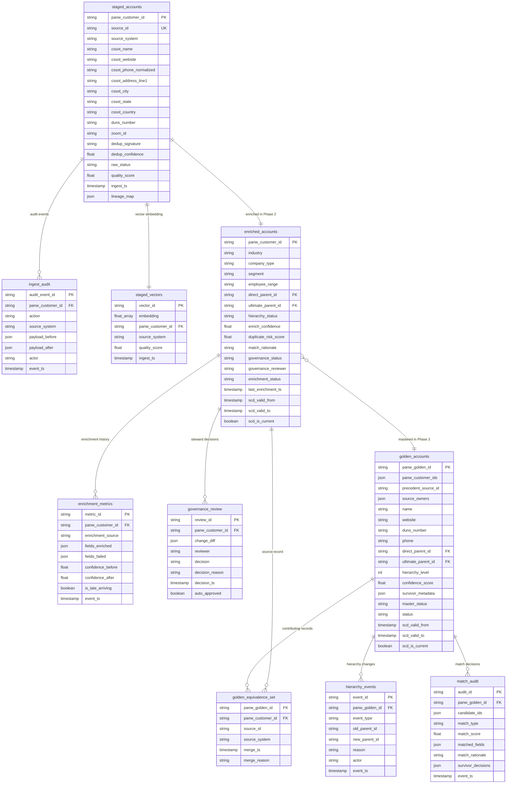
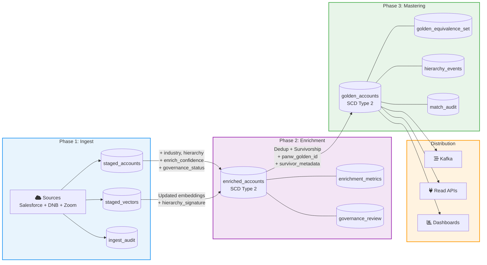
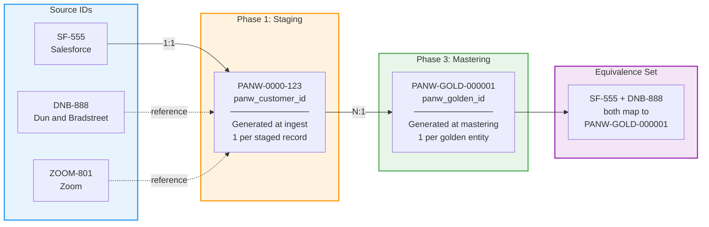

# Data Model — Cross-Phase Schema Specification

This document defines the canonical schema for each phase of the MDM pipeline, showing how fields evolve from raw ingest through enrichment to the golden master record.

---

## 1. Identity Model

```
source_id ──[Phase 1]──> panw_customer_id ──[Phase 3]──> panw_golden_id
  (1:1)                      (N:1 to golden)
```

| Identifier | Created In | Scope | Cardinality |
|------------|-----------|-------|-------------|
| `source_id` | Source system | Per source record (e.g., SF-555, DNB-888) | 1 per source record |
| `panw_customer_id` | Phase 1 (ingest) | Per ingested + staged record | 1 per staged record |
| `panw_golden_id` | Phase 3 (mastering) | Per deduplicated master entity | 1 per golden entity; maps to N `panw_customer_id` |

---

## 2. Phase 1 — Staged Accounts

### Table: `staged_accounts`
**Storage**: BigQuery (partitioned by `ingest_ts`, clustered by `source_system`)

| Column | Type | Nullable | Description | Source |
|--------|------|----------|-------------|--------|
| `panw_customer_id` | STRING (PK) | No | Internal staging identifier (UUID or deterministic hash) | Generated at ingest |
| `source_id` | STRING | No | Original ID from source system | Salesforce, DNB, Zoom |
| `source_system` | STRING | No | Originating system name | Enum: salesforce, dnb, zoom |
| `cssot_name` | STRING | No | Harmonized company name | Schema normalizer |
| `cssot_website` | STRING | Yes | Harmonized domain (lowercased, deduplicated) | Schema normalizer |
| `cssot_phone_normalized` | STRING | Yes | E.164 normalized phone | Schema normalizer |
| `cssot_address_line1` | STRING | Yes | Standardized street address | Schema normalizer |
| `cssot_city` | STRING | Yes | City | Schema normalizer |
| `cssot_state` | STRING | Yes | State / province | Schema normalizer |
| `cssot_country` | STRING | Yes | ISO 3166-1 alpha-2 country code | Schema normalizer |
| `duns_number` | STRING | Yes | D-U-N-S number (9 digits) | DNB, or null if unavailable |
| `zoom_id` | STRING | Yes | Zoom vendor identifier | Zoom, or null if unavailable |
| `vendor_references` | JSON | Yes | Array of vendor reference keys (e.g., ["DNB:1234", "ZOOM:801"]) | Enrichment merge engine |
| `candidate_group` | STRING | Yes | Business segment hint (e.g., sales, marketing) | Source metadata |
| `dedup_signature` | STRING | No | Composite key: hash(name + website + country + sellable_entity_id) | Match engine |
| `dedup_confidence` | FLOAT64 | Yes | Pre-check duplicate confidence score (0.0–1.0) | Match engine |
| `raw_status` | STRING | No | Record status: staged, duplicate_suspect, quarantined | Ingest pipeline |
| `quality_score` | FLOAT64 | Yes | Initial data completeness score | Computed at ingest |
| `ingest_ts` | TIMESTAMP | No | Ingest timestamp (UTC) | System |
| `age_days` | INT64 | No | Days since ingest (computed) | System |
| `lineage_map` | JSON | Yes | Source provenance: transformations applied, original field values | Ingest pipeline |
| `audit_event_id` | STRING | Yes | FK to `ingest_audit` log | Audit system |

### Table: `ingest_audit`
**Storage**: BigQuery (append-only, immutable)

| Column | Type | Nullable | Description |
|--------|------|----------|-------------|
| `audit_event_id` | STRING (PK) | No | Unique event identifier |
| `panw_customer_id` | STRING | No | FK to `staged_accounts` |
| `action` | STRING | No | Enum: ingest, dedup_flagged, quarantined, review_routed |
| `source_system` | STRING | No | Source that triggered the event |
| `payload_before` | JSON | Yes | Record state before action |
| `payload_after` | JSON | Yes | Record state after action |
| `actor` | STRING | No | System or user ID |
| `event_ts` | TIMESTAMP | No | Event timestamp (UTC) |

### Vector DB: `staged_vectors`
**Storage**: Google Vector DB

| Field | Type | Description |
|-------|------|-------------|
| `vector_id` | STRING | Same as `panw_customer_id` |
| `embedding` | FLOAT[768] | FSAII embedding of name + domain + address + phone |
| `panw_customer_id` | STRING (metadata) | Internal staging ID |
| `source_system` | STRING (metadata) | Originating system |
| `cssot_name` | STRING (metadata) | Harmonized name |
| `cssot_website` | STRING (metadata) | Harmonized domain |
| `quality_score` | FLOAT (metadata) | Completeness score |
| `ingest_ts` | TIMESTAMP (metadata) | Ingest time |
| `raw_status` | STRING (metadata) | Record status |

---

## 3. Phase 2 — Enriched Accounts

### Table: `enriched_accounts`
**Storage**: BigQuery (partitioned by `last_enrichment_ts`, clustered by `panw_customer_id`)

Inherits all columns from `staged_accounts` plus:

| Column | Type | Nullable | Description | Source |
|--------|------|----------|-------------|--------|
| `duns_number` | STRING | Yes | Populated or verified by enrichment | Gemini Pro / DNB |
| `company_type` | STRING | Yes | e.g., Corp, LLC, Partnership | Gemini Pro / DNB |
| `industry` | STRING | Yes | Industry classification | Gemini Pro / Zoom |
| `segment` | STRING | Yes | e.g., Enterprise, Mid-Market, SMB | Zoom firmographics |
| `employee_range` | STRING | Yes | e.g., 1000-5000 | Gemini Pro / DNB |
| `direct_parent_id` | STRING | Yes | `panw_customer_id` of direct parent | Hierarchy inference |
| `ultimate_parent_id` | STRING | Yes | `panw_customer_id` of ultimate parent (apex) | Hierarchy inference |
| `hierarchy_status` | STRING | Yes | Enum: inferred, confirmed, unknown | Hierarchy engine |
| `hierarchy_signature` | STRING | Yes | Hash of hierarchy position for vector search | Computed |
| `enrich_confidence` | FLOAT64 | Yes | Overall enrichment confidence (0.0–1.0) | Enrichment engine |
| `duplicate_risk_score` | FLOAT64 | Yes | Risk of being a duplicate (0.0–1.0) | Enrichment engine |
| `match_rationale` | STRING | Yes | Human-readable explanation of enrichment decisions | Enrichment engine |
| `enrichment_source` | STRING | Yes | Which vendor/model provided enrichment | System |
| `governance_status` | STRING | No | Enum: pending_review, approved, rejected, auto_approved | Governance UI |
| `governance_reviewer` | STRING | Yes | Steward who reviewed the record | Governance UI |
| `governance_decision_ts` | TIMESTAMP | Yes | When the governance decision was made | Governance UI |
| `quarantine_reason` | STRING | Yes | Reason for rejection (if rejected) | Governance UI |
| `enrichment_status` | STRING | No | Enum: enriched, partial, failed, re_enriched | Enrichment engine |
| `last_enrichment_ts` | TIMESTAMP | No | Last enrichment timestamp (UTC) | System |
| `scd_valid_from` | TIMESTAMP | No | SCD2 row validity start | System |
| `scd_valid_to` | TIMESTAMP | Yes | SCD2 row validity end (null = current) | System |
| `scd_is_current` | BOOLEAN | No | True if this is the current version | System |

### Table: `enrichment_metrics`
**Storage**: BigQuery

| Column | Type | Description |
|--------|------|-------------|
| `metric_id` | STRING (PK) | Unique metric event ID |
| `panw_customer_id` | STRING | FK to enriched record |
| `enrichment_source` | STRING | Gemini Pro, DNB, Zoom, rule-based |
| `fields_enriched` | JSON | Array of field names that were populated |
| `fields_failed` | JSON | Array of field names that failed enrichment |
| `confidence_before` | FLOAT64 | Confidence before this enrichment pass |
| `confidence_after` | FLOAT64 | Confidence after this enrichment pass |
| `is_late_arriving` | BOOLEAN | True if this was a late-arriving enrichment |
| `event_ts` | TIMESTAMP | Metric capture time |

### Table: `governance_review`
**Storage**: BigQuery

| Column | Type | Description |
|--------|------|-------------|
| `review_id` | STRING (PK) | Unique review ID |
| `panw_customer_id` | STRING | FK to enriched record |
| `change_diff` | JSON | Before/after diff of enriched fields |
| `reviewer` | STRING | Steward user ID |
| `decision` | STRING | Enum: approved, rejected |
| `decision_reason` | STRING | Free-text reason |
| `decision_ts` | TIMESTAMP | Decision timestamp |
| `auto_approved` | BOOLEAN | True if rules auto-approved |

---

## 4. Phase 3 — Golden Accounts (Master)

### Table: `golden_accounts`
**Storage**: Gold Master Store (BigQuery / Postgres / DynamoDB) — SCD Type 2

| Column | Type | Nullable | Description | Source |
|--------|------|----------|-------------|--------|
| `panw_golden_id` | STRING (PK*) | No | Master golden identifier | Mastering engine |
| `panw_customer_ids` | JSON | No | Array of contributing `panw_customer_id` values (equivalence set) | Mastering engine |
| `precedent_source_id` | STRING | No | Primary source_id used as precedent | Survivorship rules |
| `source_owners` | JSON | No | Array of contributing source systems | Mastering engine |
| `name` | STRING | No | Survived company name | Survivorship |
| `website` | STRING | Yes | Survived website/domain | Survivorship |
| `duns_number` | STRING | Yes | Survived D-U-N-S | Survivorship |
| `phone` | STRING | Yes | Survived phone (E.164) | Survivorship |
| `email` | STRING | Yes | Survived email | Survivorship |
| `address_line1` | STRING | Yes | Survived street address | Survivorship |
| `city` | STRING | Yes | Survived city | Survivorship |
| `state` | STRING | Yes | Survived state | Survivorship |
| `country` | STRING | Yes | Survived country (ISO 3166-1) | Survivorship |
| `company_type` | STRING | Yes | Survived company type | Survivorship |
| `industry` | STRING | Yes | Survived industry | Survivorship |
| `segment` | STRING | Yes | Survived segment | Survivorship |
| `employee_range` | STRING | Yes | Survived employee range | Survivorship |
| `direct_parent_id` | STRING | Yes | `panw_golden_id` of direct parent | Hierarchy graph |
| `ultimate_parent_id` | STRING | Yes | `panw_golden_id` of ultimate parent | Hierarchy graph |
| `hierarchy_level` | INT64 | Yes | Depth in hierarchy tree | Hierarchy graph |
| `confidence_score` | FLOAT64 | No | Overall golden record confidence | Mastering engine |
| `survivor_metadata` | JSON | No | Per-field: {source, rule, confidence} | Survivorship engine |
| `match_rationale` | STRING | Yes | Explanation of merge decision | Dedup engine |
| `matched_fields` | JSON | Yes | Fields that contributed to match | Dedup engine |
| `match_score` | FLOAT64 | Yes | Dedup match score | Dedup engine |
| `master_status` | STRING | No | Enum: golden, draft, under_review | Mastering engine |
| `status` | STRING | No | Enum: active, inactive, merged | Business status |
| `orchestration_status` | STRING | No | Enum: complete, pending_merge, pending_hierarchy | Mastering engine |
| `created_at` | TIMESTAMP | No | Record creation time | System |
| `updated_at` | TIMESTAMP | No | Last update time | System |
| `scd_valid_from` | TIMESTAMP | No | SCD2 row validity start | System |
| `scd_valid_to` | TIMESTAMP | Yes | SCD2 row validity end (null = current) | System |
| `scd_is_current` | BOOLEAN | No | True if current version | System |

\* Primary key is composite: (`panw_golden_id`, `scd_valid_from`) for SCD2.

### Table: `golden_equivalence_set`
**Storage**: Gold Master Store

| Column | Type | Description |
|--------|------|-------------|
| `panw_golden_id` | STRING | FK to `golden_accounts` |
| `panw_customer_id` | STRING | FK to `enriched_accounts` |
| `source_id` | STRING | Original source system ID |
| `source_system` | STRING | Source system name |
| `merge_ts` | TIMESTAMP | When this record was merged into the golden entity |
| `merge_reason` | STRING | Reason for merge (e.g., "vector_match_0.97") |

### Table: `hierarchy_events`
**Storage**: BigQuery (append-only)

| Column | Type | Description |
|--------|------|-------------|
| `event_id` | STRING (PK) | Unique event ID |
| `panw_golden_id` | STRING | Entity affected |
| `event_type` | STRING | Enum: parent_change, apex_change, acquisition, split, re_parent |
| `old_parent_id` | STRING | Previous parent `panw_golden_id` |
| `new_parent_id` | STRING | New parent `panw_golden_id` |
| `old_apex_id` | STRING | Previous ultimate parent |
| `new_apex_id` | STRING | New ultimate parent |
| `reason` | STRING | Human-readable reason |
| `actor` | STRING | System or user ID |
| `event_ts` | TIMESTAMP | Event timestamp |

### Table: `match_audit`
**Storage**: BigQuery (append-only)

| Column | Type | Description |
|--------|------|-------------|
| `audit_id` | STRING (PK) | Unique audit ID |
| `panw_golden_id` | STRING | Resulting golden entity |
| `candidate_ids` | JSON | Array of `panw_customer_id` values evaluated |
| `match_type` | STRING | Enum: auto_merge, manual_merge, no_match, split |
| `match_score` | FLOAT64 | Final match confidence |
| `matched_fields` | JSON | Fields that contributed to match |
| `match_rationale` | STRING | Explanation |
| `survivor_decisions` | JSON | Per-field survivorship decisions |
| `reviewer` | STRING | Steward ID (if manual) |
| `event_ts` | TIMESTAMP | Audit timestamp |

---

## 5. Field Evolution Across Phases

This table shows how key fields are born, enriched, and finalized across phases.

| Field | Phase 1 (Staged) | Phase 2 (Enriched) | Phase 3 (Golden) |
|-------|-------------------|---------------------|-------------------|
| `panw_customer_id` | Generated (UUID) | Carried forward | Part of equivalence set |
| `panw_golden_id` | — | — | Generated |
| `source_id` | From source system | Carried forward | In equivalence set |
| `cssot_name` | Harmonized from raw | Same | Survived to `name` |
| `cssot_website` | Harmonized from raw | Same | Survived to `website` |
| `duns_number` | Null or from DNB | Filled by Gemini Pro / DNB | Validated and survived |
| `industry` | — | Filled by Gemini Pro / Zoom | Survived |
| `company_type` | — | Filled by Gemini Pro / DNB | Survived |
| `segment` | — | Filled by Zoom firmographics | Survived |
| `direct_parent_id` | — | Inferred (panw_customer_id) | Resolved (panw_golden_id) |
| `ultimate_parent_id` | — | Inferred (panw_customer_id) | Resolved (panw_golden_id) |
| `hierarchy_status` | — | inferred / unknown | confirmed / inferred |
| `enrich_confidence` | — | Computed (0.0–1.0) | Rolled into `confidence_score` |
| `match_rationale` | — | Initial rationale | Final dedup rationale |
| `governance_status` | — | pending_review / approved / rejected | — (mastered) |
| `master_status` | — | — | golden / draft / under_review |
| `survivor_metadata` | — | — | Per-field source + rule |
| `quality_score` | Initial completeness | Updated with enrichment | Final golden quality |
| `scd_valid_from/to` | — | SCD2 versioning | SCD2 versioning |

---

## 6. Entity Relationship Diagram



## 7. Cross-Phase Data Flow



## 8. Identity Chain Visualization


