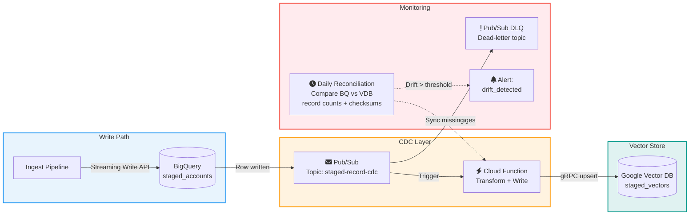

# Phase 1: CDC Sync Architecture

> Extracted from [phase1_data_ingest_flow.md](phase1_data_ingest_flow.md)

```mermaid
flowchart LR
  subgraph WRITE["Write Path"]
    PIPE["Ingest Pipeline"] -->|"Streaming Write API"| BQ[("BigQuery\nstaged_accounts")]
  end

  subgraph CDC["CDC Layer"]
    BQ -->|"Row written"| PS["fa:fa-envelope Pub/Sub\nTopic: staged-record-cdc"]
    PS -->|"Trigger"| CF["fa:fa-bolt Cloud Function\nTransform + Write"]
  end

  subgraph VECTOR["Vector Store"]
    CF -->|"gRPC upsert"| VDB[("Google Vector DB\nstaged_vectors")]
  end

  subgraph MONITOR["Monitoring"]
    PS -->|"Failed messages"| DLT["fa:fa-exclamation Pub/Sub DLQ\nDead-letter topic"]
    RECON["fa:fa-clock Daily Reconciliation\nCompare BQ vs VDB\nrecord counts + checksums"] -.->|"Drift > threshold"| ALERT["fa:fa-bell Alert:\ndrift_detected"]
    RECON -.->|"Sync missing"| CF
  end

  style WRITE fill:#e8f4fd,stroke:#2196F3,stroke-width:2px
  style CDC fill:#fff3e0,stroke:#FF9800,stroke-width:2px
  style VECTOR fill:#e0f2f1,stroke:#009688,stroke-width:2px
  style MONITOR fill:#ffebee,stroke:#f44336,stroke-width:2px
```
