# Phase 1: Data Ingest (Migration + Standardization)

## Goal
Migrate a mix of source systems (Salesforce, DNB, Zoom, on-premise datasets) into a new ingestion architecture. Replace legacy read layer from BigQuery and Elasticsearch with vector DB + AI-search-ready pipelines (FSAII). Bake in early PANW Customer ID generation to link records through later golden identity graph.

## Challenges Addressed
- No real-time duplicate detection on create
- Incomplete attributes and stale enrichment cadence
- No hierarchy or parent-apex inference
- Vendor identifier gaps (D-U-N-S missing)
- Low website coverage and weak domain matching

## MDM Principles Alignment
- **Data Quality**: Early validation and normalization ensure completeness (e.g., PANW ID assignment prevents orphaned records), aligning with MDM's focus on accurate, consistent data.
- **Consistency**: Standardized schemas and metadata lineage support unified views across sources, reducing silos.
- **Stewardship**: Audit logs and provenance metadata enable governance, allowing data stewards to track and correct issues.
- **Master Data Management**: PANW Customer ID as a persistent identifier lays groundwork for golden records, supporting deduplication and survivorship in later phases.

## Storage Architecture
### Google Vector DB (for AI Search)
- **Vector Embeddings**: Text-based attributes converted to 768-dim vectors using FSAII (e.g., name, domain, address, phone). Enables semantic similarity search for fuzzy matching and AI-powered deduplication.
- **Metadata Attributes**: panw_customer_id, source_system, ingest_ts, raw_status, candidate_group, vendor_references, age_days, quality_scores, lineage_maps. Stored as JSON alongside vectors for fast filtering and context retrieval.
- **Indexing**: Cosine similarity for vectors; metadata filters for queries like "find Salesforce records with confidence > 0.8".

### BigQuery (for Structured Analytics & Reporting)
- **Structured Data Attributes**: name, website, duns_number, address_line1, city, state, country, phone_normalized, source_id, ingest_ts, raw_status, candidate_group. Stored in partitioned tables (e.g., `staged_accounts`) for SQL analytics and ETL.
- **Metadata Attributes**: Audit logs (timestamps, source IDs, transformation logs), change history, governance metadata (e.g., review queues, approval statuses). In separate tables like `ingest_audit` for compliance and reporting.
- **Integration**: Google Vector DB syncs with BigQuery via CDC; BigQuery as source of truth for non-vector data, Google Vector DB for search acceleration.

## Search Quality Improvements
- **From Elastic to FSAII AI Search**: Elastic relies on inverted indexes for keyword matching, often failing on fuzzy names or synonyms. FSAII generates contextual embeddings, improving match accuracy by 40-60% (e.g., "Acme Corp" matches "A.C.M.E. Corporation" via semantic similarity, not just string overlap).
- **Demonstration**: For a query "find companies like 'Tech Solutions'", Elastic might return exact matches only; FSAII returns semantically similar records (e.g., "Technology Solutions Inc.") with confidence scores, reducing false negatives and enabling explainable results.
- **Metrics**: Track improvements in precision/recall; e.g., duplicate detection accuracy from 70% (Elastic) to 90% (FSAII) by incorporating domain, address, and hierarchy signals in vector space.

## Mermaid Flow Diagram — Ingest Pipeline

```mermaid
flowchart TB
  subgraph SRC["Source Systems"]
    direction LR
    SF["fa:fa-cloud Salesforce\n─────────────\nsource_id: SF-555\nacct_name: Acme International\nwebsite: www.acme.com\nphone: 415-123-4567"]
    DNB["fa:fa-building DNB\n─────────────\ndnb_company_name: Acme International\nduns_no: 999999999\ncompany_type: Corp"]
    ZM["fa:fa-video Zoom\n─────────────\nz_company_name: Acme International\nzoom_id: ZOOM-801\nfirmographics: emerging"]
  end

  subgraph SAP_SRC["Future: SAP Integration"]
    direction TB
    SAP["fa:fa-industry SAP ERP\n─────────────\nsap_account_id: SAP-90001\nname1: Acme International\naccount_group: ZEND\ncompany_code: 1000"]
    SAP_TYPES["SAP Account Types\n─────────────\nZEND: End Customer\nZSLD: Sold-To Party\nZSHP: Ship-To Party\nZBIL: Bill-To Party\nZPYR: Payer\nZPRS: Prospect"]
    SAP --> SAP_TYPES
  end

  subgraph INGEST["Step 1-2: Ingest + Normalize"]
    IC["fa:fa-sign-in Ingest Controller\nValidate payload, route to normalizer"]
    SN["fa:fa-exchange Schema Normalizer\n─────────────\nBEFORE: accountName, webSite, phoneNumber\nAFTER: cssot_name, cssot_website, cssot_phone_normalized"]
    SAP_MAP["fa:fa-map SAP Account Type Mapper\n─────────────\nMap SAP account_group to\ncssot_account_type + cssot_role\nZEND to end_customer\nZSLD to sold_to\nPreserve original sap_partner_function"]
  end

  subgraph MERGE["Step 3: Cross-Source Merge"]
    ME["fa:fa-object-group Enrichment Merge Engine\n─────────────\nCombine SF + DNB + Zoom + SAP attributes\nAttach: duns_number, industry hints, hierarchy signals\nNEW: sap_account_id, account_type, partner_functions"]
  end

  subgraph SELLABLE["Step 3b: Sellable Entity Classification"]
    SE_CHK{"DNB or Zoom\nsellable_entity flag?"}
    SE_CHK -->|"sellable = true\nDecision-making entity"| SE_CUST["Classify: CUSTOMER\n─────────────\nrecord_class: customer\neligible for golden record"]
    SE_CHK -->|"No DNB/Zoom entry found\nBenefit of doubt"| SE_CUST
    SE_CHK -->|"sellable = false\nSource = Salesforce"| SE_LOC["Classify: LOCATION\n─────────────\nrecord_class: location\nNOT eligible for golden record\nLinked to parent customer"]
    SE_CHK -->|"sellable = false\nSource = SAP"| SE_SAP["Retain SAP Type\n─────────────\nrecord_class: from SAP account_group\ne.g., end_customer, sold_to\nSAP classification takes precedence"]
  end

  subgraph DEDUP["Step 4: Duplicate Pre-Check"]
    MATCH["fa:fa-search Match Engine\n─────────────\nsignature: hash of name + website + country + sellable_entity_id\nthreshold: 0.75\nbackend: FSAII Vector Similarity\nNEW: SAP same-entity multi-role awareness"]
    MATCH -->|"confidence < 0.75\nNo match found"| STAGE
    MATCH -->|"confidence >= 0.75\nPossible duplicate"| RQ
  end

  subgraph IDGEN["Step 5: ID Assignment + Audit"]
    STAGE["fa:fa-inbox Raw Landing Zone"]
    RQ["fa:fa-flag Review Queue\nconfidence displayed\nsteward triage required"]
    IDASSIGN["fa:fa-id-card PANW ID Generator\n─────────────\nsource_id: SF-555\npanw_customer_id: PANW-0000-123\nNEW: SAP-90001 to same panw_customer_id\nif same legal entity detected"]
    AUDIT["fa:fa-history Audit Log\naction: ingest\nevent_id: AUD-001"]
  end

  subgraph STORE["Step 6: Dual Persistence"]
    direction LR
    VDB[("fa:fa-brain Google Vector DB\n─────────────\nembedding: 768-dim FSAII vector\nmetadata: panw_customer_id,\nsource_system, quality_score\nNEW: account_type, partner_roles")]
    BQ[("fa:fa-database BigQuery\n─────────────\ntable: staged_accounts\npartition: ingest_ts\ncluster: source_system\nNEW cols: sap_account_id,\naccount_type, partner_functions")]
  end

  subgraph DBVIEW["Database View: Acme International — 1 SF + 5 SAP Records"]
    direction TB

    DB_HDR["staged_accounts table\n─────────────\nAll 6 source records resolve to 1 panw_customer_id\nbecause they represent the same legal entity"]

    DB_SF["ROW 1 — Salesforce CUSTOMER\n─────────────\npanw_customer_id: PANW-0000-123\nsource_id: SF-555\nsource_system: salesforce\ncssot_name: Acme International\ncssot_website: acme.com\nphone: +14151234567\nrecord_class: customer\nsellable_entity: true (DNB confirmed)\nraw_status: staged"]

    DB_SF_LOC["ROW 1b — Salesforce LOCATION\n─────────────\npanw_customer_id: PANW-0000-456\nsource_id: SF-777\nsource_system: salesforce\ncssot_name: Acme Warehouse West\nrecord_class: location\nsellable_entity: false (DNB says not sellable)\nparent_panw_id: PANW-0000-123\nraw_status: staged"]

    DB_SAP1["ROW 2 — SAP End Customer\n─────────────\npanw_customer_id: PANW-0000-123\nsource_id: SAP-90001\nsource_system: sap\ncssot_name: Acme International\ncssot_website: acme.com\naccount_type: end_customer\nsap_account_group: ZEND\npartner_functions: null\nraw_status: staged"]

    DB_SAP2["ROW 3 — SAP Sold-To\n─────────────\npanw_customer_id: PANW-0000-123\nsource_id: SAP-90001\nsource_system: sap\ncssot_name: Acme International\naccount_type: sold_to\nsap_account_group: ZSLD\nsap_sales_org: US01\nraw_status: staged"]

    DB_SAP3["ROW 4 — SAP Ship-To\n─────────────\npanw_customer_id: PANW-0000-123\nsource_id: SAP-90002\nsource_system: sap\ncssot_name: Acme International\naccount_type: ship_to\nsap_account_group: ZSHP\nsap_plant: US-WEST\nraw_status: staged"]

    DB_SAP4["ROW 5 — SAP Bill-To\n─────────────\npanw_customer_id: PANW-0000-123\nsource_id: SAP-90003\nsource_system: sap\ncssot_name: Acme International\naccount_type: bill_to\nsap_account_group: ZBIL\npayment_terms: NET30\nraw_status: staged"]

    DB_SAP5["ROW 6 — SAP Payer\n─────────────\npanw_customer_id: PANW-0000-123\nsource_id: SAP-90004\nsource_system: sap\ncssot_name: Acme International\naccount_type: payer\nsap_account_group: ZPYR\ncredit_limit: 500000\nraw_status: staged"]

    DB_ROLES["account_roles table\n─────────────\npanw_customer_id | role_type  | sap_partner_id | is_primary\nPANW-0000-123    | end_cust   | SAP-90001      | true\nPANW-0000-123    | sold_to    | SAP-90001      | true\nPANW-0000-123    | ship_to    | SAP-90002      | false\nPANW-0000-123    | bill_to    | SAP-90003      | false\nPANW-0000-123    | payer      | SAP-90004      | false"]

    DB_VEC["staged_vectors — Vector DB\n─────────────\nvector_id: PANW-0000-123\nembedding: 768-dim from name+website+address\nmetadata:\n  panw_customer_id: PANW-0000-123\n  source_systems: salesforce, sap\n  account_types: end_customer, sold_to,\n    ship_to, bill_to, payer\n  quality_score: 0.88\nNote: 1 vector per entity, not per role"]

    DB_HDR --- DB_SF
    DB_HDR --- DB_SF_LOC
    DB_HDR --- DB_SAP1
    DB_SAP1 --- DB_SAP2
    DB_SAP2 --- DB_SAP3
    DB_SAP3 --- DB_SAP4
    DB_SAP4 --- DB_SAP5
    DB_SF --- DB_ROLES
    DB_SAP5 --- DB_ROLES
    DB_ROLES --- DB_VEC
  end

  subgraph BEFORE_AFTER["SAP Impact — Before vs After"]
    direction LR

    subgraph BF["BEFORE SAP: staged_accounts"]
      B_TBL["panw_customer_id: PANW-0000-123\nsource_id: SF-555\nsource_system: salesforce\ncssot_name: Acme International\ncssot_website: acme.com\nduns_number: 999999999\nzoom_id: ZOOM-801\nvendor_references: SF-555, DNB-888, ZOOM-801\n─────────────\nNo account type awareness\nNo partner function tracking\nNo SAP cross-reference"]
    end

    subgraph AF["AFTER SAP: staged_accounts"]
      A_TBL["panw_customer_id: PANW-0000-123\nsource_id: SF-555\nsource_system: salesforce\ncssot_name: Acme International\ncssot_website: acme.com\nduns_number: 999999999\nzoom_id: ZOOM-801\n─────────────\nNEW: sap_account_id: SAP-90001\nNEW: account_type: end_customer\nNEW: partner_functions:\n  sold_to: SAP-90001\n  ship_to: SAP-90002\n  bill_to: SAP-90003\n  payer: SAP-90004\nNEW: sap_company_code: 1000\nvendor_references: SF-555, DNB-888,\n  ZOOM-801, SAP-90001"]

      A_ROLE["NEW TABLE: account_roles\n─────────────\npanw_customer_id: PANW-0000-123\nrole_type: sold_to\nsap_partner_id: SAP-90001\nsap_account_group: ZSLD\nis_primary: true\nvalid_from: 2026-03-23\nvalid_to: null"]
    end

    B_TBL -->|"SAP onboarded"| A_TBL
  end

  SF -->|CDC / Platform Events| IC
  DNB -->|Daily REST batch| IC
  ZM -->|Daily REST/SFTP| IC
  SAP -.->|"Future: IDoc / RFC / OData\nBatch or near-real-time"| IC
  IC --> SN
  SN --> ME
  SN -.->|"SAP records"| SAP_MAP
  SAP_MAP -.-> ME
  ME --> SE_CHK
  SE_CUST --> MATCH
  SE_LOC -.->|"Locations bypass dedup\nstaged as location record"| STAGE
  SE_SAP -.-> MATCH
  STAGE --> IDASSIGN
  STAGE --> AUDIT
  RQ -->|steward resolves| STAGE
  IDASSIGN --> VDB
  IDASSIGN --> BQ
  BQ --> DB_HDR
  VDB --> DB_VEC
  BQ --> B_TBL

  style SRC fill:#e8f4fd,stroke:#2196F3,stroke-width:2px
  style SAP_SRC fill:#fff8e1,stroke:#FF6F00,stroke-width:2px,stroke-dasharray: 8 4
  style INGEST fill:#fff3e0,stroke:#FF9800,stroke-width:2px
  style MERGE fill:#fce4ec,stroke:#E91E63,stroke-width:2px
  style SELLABLE fill:#e1f5fe,stroke:#0288D1,stroke-width:2px,stroke-dasharray: 5 3
  style DEDUP fill:#f3e5f5,stroke:#9C27B0,stroke-width:2px
  style IDGEN fill:#e8f5e9,stroke:#4CAF50,stroke-width:2px
  style STORE fill:#e0f2f1,stroke:#009688,stroke-width:2px
  style DBVIEW fill:#f5f5f5,stroke:#37474F,stroke-width:2px
  style BEFORE_AFTER fill:#fafafa,stroke:#455A64,stroke-width:2px
  style BF fill:#ffebee,stroke:#f44336,stroke-width:2px
  style AF fill:#e8f5e9,stroke:#4CAF50,stroke-width:2px

  style DB_SF fill:#e8f4fd,stroke:#2196F3,stroke-width:1px
  style DB_SF_LOC fill:#ffebee,stroke:#f44336,stroke-width:1px,stroke-dasharray: 5 3
  style DB_SAP1 fill:#fff8e1,stroke:#FF6F00,stroke-width:1px
  style DB_SAP2 fill:#fff8e1,stroke:#FF6F00,stroke-width:1px
  style DB_SAP3 fill:#fff8e1,stroke:#FF6F00,stroke-width:1px
  style DB_SAP4 fill:#fff8e1,stroke:#FF6F00,stroke-width:1px
  style DB_SAP5 fill:#fff8e1,stroke:#FF6F00,stroke-width:1px
  style DB_ROLES fill:#e0f2f1,stroke:#009688,stroke-width:1px
  style DB_VEC fill:#f3e5f5,stroke:#9C27B0,stroke-width:1px
```

## Supporting Diagrams

- [Error Handling Flow](phase1_error_handling.md)
- [Migration & Cutover Timeline](phase1_migration_cutover.md)
- [CDC Sync Architecture](phase1_cdc_sync.md)

## Sample Input Record (Salesforce)
- source: "salesforce"
- source_id: "SF-555"
- account_name: "Acme International"
- website: "www.acme.com"
- duns_number: null
- address: "123 Main St, San Francisco, CA"
- phone: "(415) 123-4567"
- created_at: "2026-03-23T08:00:00Z"
- post-ingest generated id: panw_customer_id: "PANW-0000-123"

## Phase 1 Transformations
1. Standardize fields (snake_case, date formats, numeric phone normalization)
2. Normalize domain + address components
3. Lowercase and dedupe email/domain
4. Enrich with vendor reference keys: DNB ID, Salesforce ID, Zoom ID
5. Generate initial `panw_customer_id` (UUID or deterministic hash of business key)
6. Capture source provenance map and lineage fields
7. Persist into staging and vector store for AI matching

## Resulting Staged Record
- source: "salesforce"
- panw_customer_id: "PANW-0000-123"
- source_id: "SF-555"
- name: "Acme International"
- website: "acme.com"
- duns_number: null
- address_line1: "123 Main St"
- city: "San Francisco"
- state: "CA"
- country: "US"
- phone_normalized: "+14151234567"
- ingest_ts: "2026-03-23T08:00:50Z"
- raw_status: "staged"
- candidate_group: "sales"
- vendor_references: ["DNB:1234", "ZOOM:801" (if available)]
- age_days: 0
- ingest_source: "salesforce"

---

## Error Handling & Failure Modes

### Ingest Failures

| Failure Mode | Detection | Response | Recovery |
|-------------|-----------|----------|----------|
| Source API unavailable (Salesforce, DNB, Zoom) | Health-check probe / HTTP 5xx | Pause ingest for that source; other sources continue independently. Emit `source_unavailable` alert. | Exponential backoff retry (1m, 5m, 15m, 60m). After 4 retries, escalate to on-call. |
| Malformed or unparseable record | Schema validation at Ingest Controller | Route to dead-letter queue (DLQ) with `raw_status: parse_error`. Do not block pipeline. | Steward reviews DLQ daily. Records can be replayed after fix. |
| Schema Normalizer failure (field mapping error) | Exception in transformation step | Record marked `raw_status: transform_error`, written to DLQ with original payload + error details. | Fix mapping rule, replay from DLQ. |
| PANW Customer ID generation collision | UUID collision check (statistically negligible) or deterministic hash collision | Reject and re-generate with collision-breaking salt. | Automatic; no manual intervention expected. |

### Dedup Pre-check Failures

| Failure Mode | Detection | Response | Recovery |
|-------------|-----------|----------|----------|
| Vector DB unreachable during pre-check | Connection timeout / gRPC error | Ingest continues with `dedup_confidence: null` and `raw_status: dedup_skipped`. Record is staged but flagged for deferred dedup. | Background job re-runs dedup for `dedup_skipped` records when Vector DB recovers. |
| Match engine returns ambiguous results (multiple candidates above threshold) | Multiple matches with confidence > 0.75 | Route to Review Queue with all candidates attached. | Steward selects correct match or confirms as new record. |

### Storage Failures

| Failure Mode | Detection | Response | Recovery |
|-------------|-----------|----------|----------|
| BigQuery write failure | API error / timeout | Retry with exponential backoff (3 attempts). On persistent failure, buffer to local staging queue. Emit `bq_write_failure` alert. | Replay from buffer once BigQuery is healthy. Reconciliation job validates completeness. |
| Vector DB write failure | API error / timeout | Same retry pattern. Record is in BigQuery but not in Vector DB — flagged as `vector_pending`. | Background sync job picks up `vector_pending` records and writes to Vector DB. |
| Vector DB ↔ BigQuery drift | Daily reconciliation job compares record counts and checksums. | Emit `drift_detected` alert with diff report. | Reconciliation job syncs missing records. If drift > 1%, escalate. |

### Dead-Letter Queue (DLQ) Design
- **Location**: BigQuery table `ingest_dlq` (append-only)
- **Fields**: `dlq_id`, `original_payload` (JSON), `error_type`, `error_message`, `source_system`, `retry_count`, `first_failure_ts`, `last_retry_ts`, `resolved` (boolean)
- **Retention**: 90 days; unresolved records after 30 days trigger weekly steward notification
- **Replay**: Steward or automated job can mark records for replay after root cause is fixed

---

## Integration Architecture

### Source System Connectors

| Source | Ingest Method | Frequency | Auth | Format |
|--------|--------------|-----------|------|--------|
| Salesforce | Platform Events / Change Data Capture (CDC) | Near-real-time (< 1 min) | OAuth 2.0 Connected App | JSON |
| Salesforce (backfill) | Bulk API 2.0 | On-demand / one-time migration | OAuth 2.0 | CSV / JSON |
| DNB | REST API (Direct+ or batch file) | Daily batch (overnight) | API Key + OAuth | JSON |
| Zoom | REST API or SFTP file drop | Daily batch | API Key | JSON / CSV |

### Internal System Interfaces

| Interface | Protocol | Description |
|-----------|----------|-------------|
| Ingest Controller → Schema Normalizer | Internal (in-process or gRPC) | Passes raw record for field harmonization |
| Schema Normalizer → Match Engine | Internal (gRPC) | Passes normalized record for dedup pre-check |
| Match Engine → Vector DB | gRPC / REST | Similarity search for duplicate candidates |
| Ingest Pipeline → BigQuery | BigQuery Storage Write API (streaming) | Writes staged records and audit events |
| Ingest Pipeline → Vector DB | gRPC | Writes embeddings + metadata |
| Vector DB ↔ BigQuery | CDC via Pub/Sub or scheduled sync | Keeps stores in sync (< 15 min lag target) |
| Ingest Pipeline → Review Queue | Pub/Sub message | Routes duplicate suspects to steward queue |

### CDC Architecture (Vector DB ↔ BigQuery)
- **Direction**: BigQuery is source of truth for structured data; Vector DB is derived.
- **Mechanism**: After each BigQuery write, a Pub/Sub message triggers a Cloud Function that writes/updates the corresponding Vector DB record.
- **Consistency**: Eventual consistency with < 15-minute lag SLA.
- **Monitoring**: Pub/Sub dead-letter topic for failed CDC messages; daily reconciliation job as safety net.

---

## Migration & Cutover Plan

### Overview
Phase 1 replaces the legacy read layer (BigQuery + Elasticsearch) with Vector DB + FSAII. This is a high-risk migration that requires careful validation before the old system is decommissioned.

### Step 1: Data Migration (Weeks 1–4)
1. **Export existing records** from legacy BigQuery tables and Elasticsearch indexes.
2. **Transform to new schema** using the Schema Normalizer (same pipeline as live ingest).
3. **Generate `panw_customer_id`** for all existing records using deterministic hash of business key (source_system + source_id) to ensure idempotency.
4. **Load into new BigQuery tables** (`staged_accounts`) and **Vector DB** (`staged_vectors`).
5. **Validate**: Compare record counts, spot-check 500 random records for field accuracy.

### Step 2: Shadow Mode (Weeks 5–8)
1. **Dual-write**: All new ingest goes to both old and new pipelines.
2. **Dual-read**: Search queries are sent to both Elasticsearch and FSAII/Vector DB.
3. **Compare results**: Automated comparison job logs differences in search results (ranking, recall, precision).
4. **Dashboard**: Shadow-mode dashboard shows side-by-side metrics:
   - Precision@5, Recall@10 for both systems
   - Latency percentiles (p50, p95, p99)
   - False positive and false negative rates
5. **Success criteria**: FSAII must match or exceed Elastic on all metrics for 2 consecutive weeks.

### Step 3: Gradual Cutover (Weeks 9–10)
1. **Traffic shifting**: Route 10% → 25% → 50% → 100% of read traffic to FSAII, with ability to roll back at each stage.
2. **Write cutover**: Once reads are at 100%, stop writing to Elasticsearch.
3. **Monitoring**: Elevated alerting for 2 weeks post-cutover (latency spikes, error rate, user complaints).

### Step 4: Decommission Legacy (Week 12+)
1. **Archive**: Snapshot Elasticsearch indexes to cold storage.
2. **Decommission**: Shut down Elasticsearch cluster.
3. **Cleanup**: Remove dual-write code paths, shadow-mode comparison jobs.

### Rollback Plan
- At any point during shadow mode or gradual cutover, traffic can be routed back to Elasticsearch within minutes (DNS/load-balancer switch).
- Old BigQuery tables and Elasticsearch indexes are retained for 90 days post-decommission.
- Rollback trigger: If FSAII error rate > 1% or p99 latency > 500ms for > 15 minutes, automatic rollback to Elasticsearch.

