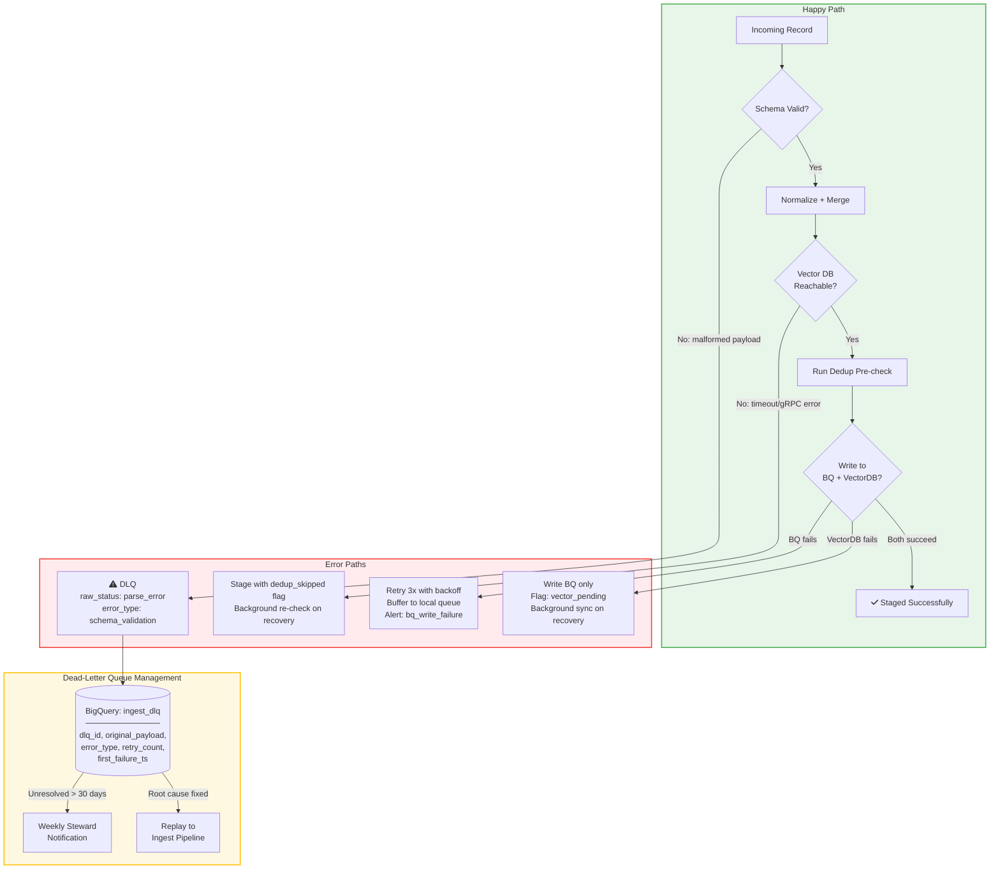

# Phase 1: Error Handling Flow

> Extracted from [phase1_data_ingest_flow.md](phase1_data_ingest_flow.md)

```mermaid
flowchart TB
  subgraph HAPPY["Happy Path"]
    direction LR
    REC[Incoming Record] --> VAL{Schema Valid?}
    VAL -->|Yes| NORM[Normalize + Merge]
    NORM --> DEDUP_CHK{Vector DB\nReachable?}
    DEDUP_CHK -->|Yes| MATCH_RUN[Run Dedup Pre-check]
    MATCH_RUN --> PERSIST{Write to\nBQ + VectorDB?}
    PERSIST -->|Both succeed| DONE["fa:fa-check Staged Successfully"]
  end

  subgraph ERRORS["Error Paths"]
    VAL -->|"No: malformed payload"| DLQ_PARSE["fa:fa-exclamation-triangle DLQ\nraw_status: parse_error\nerror_type: schema_validation"]
    DEDUP_CHK -->|"No: timeout/gRPC error"| SKIP["Stage with dedup_skipped flag\nBackground re-check on recovery"]
    PERSIST -->|"BQ fails"| RETRY_BQ["Retry 3x with backoff\nBuffer to local queue\nAlert: bq_write_failure"]
    PERSIST -->|"VectorDB fails"| FLAG_V["Write BQ only\nFlag: vector_pending\nBackground sync on recovery"]
  end

  subgraph DLQ_MGMT["Dead-Letter Queue Management"]
    DLQ_PARSE --> DLQ_TBL[("BigQuery: ingest_dlq\n─────────────\ndlq_id, original_payload,\nerror_type, retry_count,\nfirst_failure_ts")]
    DLQ_TBL -->|"Unresolved > 30 days"| NOTIFY["Weekly Steward\nNotification"]
    DLQ_TBL -->|"Root cause fixed"| REPLAY["Replay to\nIngest Pipeline"]
  end

  style HAPPY fill:#e8f5e9,stroke:#4CAF50,stroke-width:2px
  style ERRORS fill:#ffebee,stroke:#f44336,stroke-width:2px
  style DLQ_MGMT fill:#fff8e1,stroke:#FFC107,stroke-width:2px
```
