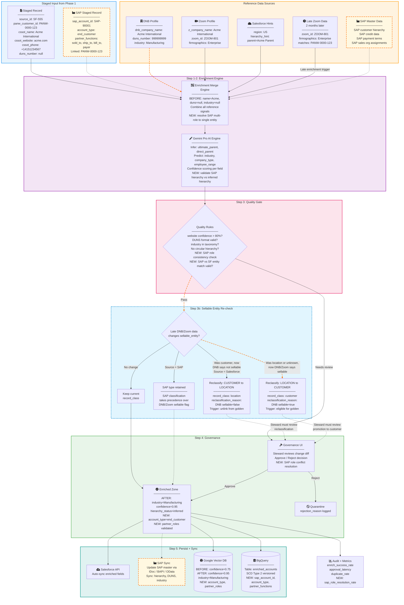

# Phase 2: Data Enrichment (AI + Hierarchy + Stewardship)

## Goal
Enrich staged records using AI (Gemini Pro), hierarchy inference, and steering value while enabling stewardship and governance UI with pre-approval auto-sync to Salesforce.

## Challenges Addressed
- Informatica limitations with null recovery
- Missing hierarchy/parent/apex relationships
- No record-level enrichment visibility or approval
- No match explainability, no standardized data-quality policy

## MDM Principles Alignment
- **Data Quality**: Enrichment and validation reduce dirty attributes and improve match confidence.
- **Consistency**: Harmonized reference data across vendor and transactional streams.
- **Stewardship**: Governance UI enables human review, approval, and audit of changes.
- **Master Data Management**: Parent hierarchy inference builds foundation for golden record construction.

## Storage Architecture
### Google Vector DB (AI Search + Matching Cache)
- Embeddings: `name`, `website`, `address`, `hierarchy_signature`, `lineage_token` from staged records.
- Metadata: `panw_customer_id`, `source_id`, `dnb_company_name`, `z_company_name`, `duns_number`, `enrich_confidence`, `match_rationale`.
- Supports fast similarity queries driven by Gemini Pro embeddings and live quality signals.

### BigQuery (Enriched Analytics & Reporting)
- Enriched table `enriched_accounts` stores structured fields with stewardship data and audit columns.
- Quality tables `enrichment_metrics` and `governance_review` store appraisal status, approvals, and delay metrics.
- Periodic sync from Vector DB ensures analysis is aligned with latest enrichment state.

## Mermaid Flow Diagram — Enrichment Pipeline



### SAP Impact on Phase 2 Database — Before vs After

See [phase2_sap_impact.md](phase2_sap_impact.md) for the before/after diagram.

## Supporting Diagrams

- [Gemini Pro Fallback Strategy](phase2_gemini_fallback.md)
- [Late-Arriving Enrichment Sequence](phase2_late_arriving.md)
- [Governance UI Workflow](phase2_governance_ui.md)
- [SAP Impact — Before vs After](phase2_sap_impact.md)

## Incoming Enriched Sample Record from Phase 1
- source_id: "SF-555" (source system key)
- panw_customer_id: "PANW-0000-123" (phase-1 generated staging id)
- name: "Acme International"
- website: "acme.com"
- duns_number: null
- status: "staged"

## Enrichment and Checks
1. Generate name embeddings for AI vector search (FSAII)
2. Combine with domain+address+phone match signatures
3. Infer `ultimate_parent` and `direct_parent` from hierarchy graphs
4. Fill missing fields with vendor / AI predicted values:
   - `duns_number`: 999999999
   - `company_type`, `industry`, `employee_range`
5. Validate key attributes:
   - `website` confidence score > 80%
   - address match, DUNS verify
   - mark low coverage for marketing domain attributes
6. Assign `duplicate_risk_score`, `enrich_confidence`, `match_rationale`
7. Write enrichment update to Governance UI table with change diff

## Sample Enriched Record
- panw_customer_id: "PANW-0000-123"
- source_id: "SF-555"
- name: "Acme International"
- website: "acme.com"
- duns_number: "999999999"
- direct_parent: "ACME-PARENT"
- ultimate_parent: "ACME-ULTIMATE"
- hierarchy_status: "inferred"
- company_type: "Corp"
- industry: "Manufacturing"
- segment: "Enterprise"
- menu_status: "enriched"
- enrich_confidence: 0.92
- match_rationale: "AI name+domain 0.93, DNB match 0.87"
- governance_status: "pending_review"
- last_quality_check: "2026-03-23T10:18:00Z"

## Governance/Sync Actions
- Data steward reviews changes; approval triggers auto-sync to Salesforce (and optional downstream consumer)
- Rejected records go to `quarantine` with feedback reason
- Metrics captured: `enrich_success_rate`, `duplicate_rate`, `approval_latency`

## Late-Arriving Enrichment Scenario
This scenario handles cases where new reference data arrives after initial enrichment, such as Zoom or DNB data becoming available 2 months later.

### Flow Description
1. **Initial State**: New Salesforce record ingested in Phase 1 with no matching Zoom/DNB data. It gets staged with basic enrichment (e.g., panw_customer_id: PANW-0000-123, name: Acme International, website: acme.com, but missing duns_number, industry).
2. **Late Data Arrival**: 2 months later, Zoom provides matching data (e.g., z_company_name: Acme International, zoom_id: ZOOM-801, firmographics: Enterprise).
3. **Re-Enrichment Trigger**: The late Zoom data is ingested and matched to the existing staged record via panw_customer_id or similarity search.
4. **Enrichment Update**: Enrichment Merge Engine combines the new Zoom data with existing staged data. Gemini Pro re-infers hierarchy and fills missing fields (e.g., adds industry: Manufacturing, firmographics: Enterprise).
5. **Validation & Governance**: Quality rules check the updated record. If it passes, it goes to Enriched Zone for auto-sync to Salesforce and persistence to Google Vector DB/BigQuery.
6. **Golden Repo Impact**: In Phase 3, the updated enriched record may trigger re-deduplication or survivorship if it affects match confidence. The golden record (panw_golden_id) gets updated with new attributes, maintaining audit history in SCD Type 2.
7. **Source Update**: Salesforce is auto-synced with enriched fields (e.g., new industry, firmographics) via API, ensuring the source system reflects the latest master data.

### Phase Involvement
- **Phase 2 (Enrichment)**: Primary handling of late data arrival, re-enrichment, and governance approval.
- **Phase 3 (Master)**: Optional re-processing if enrichment changes affect dedupe or survivorship rules.

### Sample Updated Record
- panw_customer_id: "PANW-0000-123"
- source_id: "SF-555"
- name: "Acme International"
- website: "acme.com"
- duns_number: null (still missing)
- industry: "Manufacturing" (added from Zoom)
- firmographics: "Enterprise" (added from Zoom)
- enrich_confidence: 0.95 (increased due to new data)
- last_enrichment_update: "2026-05-23T10:00:00Z" (2 months later)
- governance_status: "auto_approved" (passed rules)

---

## Error Handling & Failure Modes

### AI Enrichment Failures

| Failure Mode | Detection | Response | Recovery |
|-------------|-----------|----------|----------|
| Gemini Pro API unavailable or rate-limited | HTTP 429/503, timeout > 10s | Switch to **rule-based fallback enrichment** (lookup tables + deterministic field mapping). Record marked `enrichment_source: rule_fallback`. | Queue failed records for re-enrichment when Gemini Pro recovers. Background job retries with exponential backoff (5m, 15m, 60m). |
| Gemini Pro returns low-confidence result (< 0.5) | Confidence score below threshold | Accept partial enrichment for fields above threshold; leave remaining fields null. Mark `enrichment_status: partial`. Route to Governance UI for steward review. | Steward can trigger manual re-enrichment or accept partial result. |
| Gemini Pro returns hallucinated/incorrect data | Post-enrichment validation rules (e.g., DUNS format check, country code validation, industry against allowed taxonomy) | Reject invalid fields; keep pre-enrichment values. Mark `enrichment_status: validation_failed` for affected fields. | Log to `enrichment_metrics` with `fields_failed` detail. Steward reviews and can override. |
| Hierarchy inference produces circular reference | Graph cycle detection (parent → child → parent) | Reject hierarchy assignment. Mark `hierarchy_status: cycle_detected`. | Route to steward for manual hierarchy placement. |

### Salesforce Sync Failures

| Failure Mode | Detection | Response | Recovery |
|-------------|-----------|----------|----------|
| Salesforce API returns error (400/500) | HTTP status code | Log failure to `sync_failures` table. Record stays in `governance_status: approved` but `sync_status: failed`. | Retry queue with exponential backoff (1m, 5m, 30m). After 3 retries, escalate to steward with error details. |
| Salesforce API rate limit exceeded | HTTP 429 | Pause sync for backoff period. Queue remaining records. | Resume after rate limit window resets. Batch sync during off-peak hours if persistent. |
| Partial batch failure (some records succeed, others fail) | Per-record response codes in Bulk API | Successful records marked `sync_status: synced`. Failed records marked `sync_status: partial_failure` with per-record error. | Retry only failed records. Do not re-sync already-successful records. |
| Field-level conflict in Salesforce (e.g., record locked by another process) | SFDC error: `UNABLE_TO_LOCK_ROW` | Skip record; add to retry queue. | Retry after 5 minutes. If persistent, escalate to Salesforce admin. |

### Governance Queue Failures

| Failure Mode | Detection | Response | Recovery |
|-------------|-----------|----------|----------|
| Review queue backlog (records pending > 48 hours) | Monitoring job checks `governance_decision_ts` vs `last_enrichment_ts` | Emit `stale_review` alert to steward team lead. | Auto-approve low-risk records (enrich_confidence > 0.95, no hierarchy changes). Escalate high-risk records. |
| Steward approves incorrect enrichment (later discovered) | Manual report or downstream data quality flag | Record can be **rolled back** to previous SCD2 version. New enrichment pass triggered. | SCD2 versioning in `enriched_accounts` preserves all prior states. Steward selects version to restore. |

### Storage Failures

| Failure Mode | Detection | Response | Recovery |
|-------------|-----------|----------|----------|
| Vector DB write failure after enrichment | API error / timeout | Record is in BigQuery but not in Vector DB — flagged as `vector_pending`. | Background sync job picks up `vector_pending` records. Same as Phase 1 pattern. |
| BigQuery write failure after enrichment | API error / timeout | Buffer to local queue. Emit `bq_write_failure` alert. | Replay from buffer. Reconciliation job validates. |
| CDC desync after enrichment update | Daily reconciliation | Alert on drift | Re-sync affected records from BigQuery to Vector DB. |

### Rollback via SCD Type 2
- Every enrichment change creates a new row in `enriched_accounts` with `scd_valid_from = now()` and closes the previous row (`scd_valid_to = now()`, `scd_is_current = false`).
- To roll back: set `scd_is_current = false` on the bad row, set `scd_is_current = true` and `scd_valid_to = null` on the previous row.
- Downstream consumers (Salesforce sync, Vector DB) are notified via CDC to propagate the rollback.

---

## Integration Architecture

### Enrichment Pipeline Interfaces

| Interface | Protocol | Description |
|-----------|----------|-------------|
| Enrichment Engine → Gemini Pro | REST API (HTTPS) | Sends record attributes, receives enriched fields + confidence scores |
| Enrichment Engine → DNB API | REST API (HTTPS) | Reference lookup for DUNS, hierarchy, company profile |
| Enrichment Engine → Zoom API | REST API (HTTPS) | Reference lookup for firmographics, industry |
| Enrichment Engine → Vector DB | gRPC | Similarity search for hierarchy inference and duplicate risk |
| Enrichment Engine → BigQuery | BigQuery Storage Write API | Writes enriched records with SCD2 versioning |
| Governance UI → Backend API | REST API (HTTPS) | Steward actions: approve, reject, view diff, trigger re-enrichment |
| Backend API → Salesforce | Salesforce REST API / Bulk API 2.0 | Auto-sync approved enrichment to CRM |
| Backend API → Pub/Sub | Pub/Sub (HTTPS) | Emit enrichment events for CDC and downstream consumers |

### Governance UI Architecture
- **Frontend**: Web application (React or equivalent) with role-based access.
- **Roles**:
  - **Admin**: Configure enrichment rules, quality thresholds, auto-approve policies.
  - **Data Steward**: Review/approve/reject enrichment changes, view change diffs, trigger re-enrichment.
  - **Viewer**: Read-only access to enrichment status, metrics dashboards.
- **Authentication**: SSO via corporate IdP (SAML/OIDC).
- **Key screens**:
  - Review Queue: list of pending records with change diffs, confidence scores, and enrichment source.
  - Record Detail: full before/after view with field-level provenance.
  - Metrics Dashboard: enrich_success_rate, approval_latency, duplicate_rate, rejection_rate.
  - Quarantine View: rejected records with reasons, option to re-route for re-enrichment.

### Gemini Pro Fallback Strategy
1. **Primary**: Gemini Pro API for AI enrichment (confidence-scored, hierarchy-aware).
2. **Fallback 1**: Rule-based enrichment using DNB/Zoom lookup tables (no AI inference).
3. **Fallback 2**: Mark record as `enrichment_status: deferred` and queue for next enrichment cycle.
4. **Circuit breaker**: If Gemini Pro error rate > 20% over 5-minute window, automatically switch all traffic to Fallback 1. Resume Gemini Pro traffic gradually (10% → 50% → 100%) after 3 consecutive successful health checks.

---

### Data State in Storage Systems (Before/After)

#### Google Vector DB (Before Late Enrichment)
- **Vector Embedding**: [0.123, 0.456, ...] (name + website only)
- **Metadata**:
  - panw_customer_id: "PANW-0000-123"
  - source_id: "SF-555"
  - name: "Acme International"
  - website: "acme.com"
  - duns_number: null
  - enrich_confidence: 0.75
  - match_rationale: "Basic staging, no vendor match"
  - last_update: "2026-03-23T10:00:00Z"

#### Google Vector DB (After Late Enrichment)
- **Vector Embedding**: [0.123, 0.456, ...] (updated with industry + firmographics)
- **Metadata**:
  - panw_customer_id: "PANW-0000-123"
  - source_id: "SF-555"
  - name: "Acme International"
  - website: "acme.com"
  - duns_number: null
  - industry: "Manufacturing"
  - firmographics: "Enterprise"
  - zoom_id: "ZOOM-801"
  - enrich_confidence: 0.95
  - match_rationale: "Late Zoom data added, confidence improved"
  - last_update: "2026-05-23T10:00:00Z"

#### BigQuery (Before Late Enrichment)
```sql
-- enriched_accounts table
INSERT INTO enriched_accounts (
  panw_customer_id, source_id, name, website, duns_number, industry, zoom_id, enrich_confidence, last_update
) VALUES (
  'PANW-0000-123', 'SF-555', 'Acme International', 'acme.com', NULL, NULL, NULL, 0.75, '2026-03-23T10:00:00Z'
);
```

#### BigQuery (After Late Enrichment)
```sql
-- enriched_accounts table (updated row)
UPDATE enriched_accounts
SET industry = 'Manufacturing',
    firmographics = 'Enterprise',
    zoom_id = 'ZOOM-801',
    enrich_confidence = 0.95,
    last_update = '2026-05-23T10:00:00Z'
WHERE panw_customer_id = 'PANW-0000-123';
```

