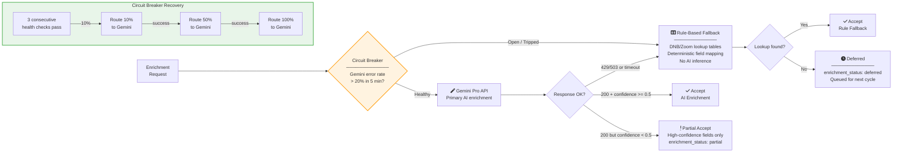

# Phase 2: Gemini Pro Fallback Strategy

> Extracted from [phase2_data_enrichment_flow.md](phase2_data_enrichment_flow.md)

```mermaid
flowchart LR
  REQ["Enrichment\nRequest"] --> CB{"Circuit Breaker\n─────────────\nGemini error rate\n> 20% in 5 min?"}

  CB -->|"Healthy"| GP["fa:fa-magic Gemini Pro API\nPrimary AI enrichment"]
  CB -->|"Open / Tripped"| FB1

  GP --> CHK{Response OK?}
  CHK -->|"200 + confidence >= 0.5"| ACCEPT["fa:fa-check Accept\nAI Enrichment"]
  CHK -->|"429/503 or timeout"| FB1["fa:fa-table Rule-Based Fallback\n─────────────\nDNB/Zoom lookup tables\nDeterministic field mapping\nNo AI inference"]
  CHK -->|"200 but confidence < 0.5"| PARTIAL["fa:fa-exclamation Partial Accept\nHigh-confidence fields only\nenrichment_status: partial"]

  FB1 --> FB1_CHK{Lookup found?}
  FB1_CHK -->|"Yes"| ACCEPT_FB["fa:fa-check Accept\nRule Fallback"]
  FB1_CHK -->|"No"| FB2["fa:fa-clock Deferred\n─────────────\nenrichment_status: deferred\nQueued for next cycle"]

  subgraph RECOVERY["Circuit Breaker Recovery"]
    direction LR
    HEALTH["3 consecutive\nhealth checks pass"] -->|"10%"| R10["Route 10%\nto Gemini"]
    R10 -->|"success"| R50["Route 50%\nto Gemini"]
    R50 -->|"success"| R100["Route 100%\nto Gemini"]
  end

  style CB fill:#fff3e0,stroke:#FF9800,stroke-width:2px
  style RECOVERY fill:#e8f5e9,stroke:#4CAF50,stroke-width:2px
```
