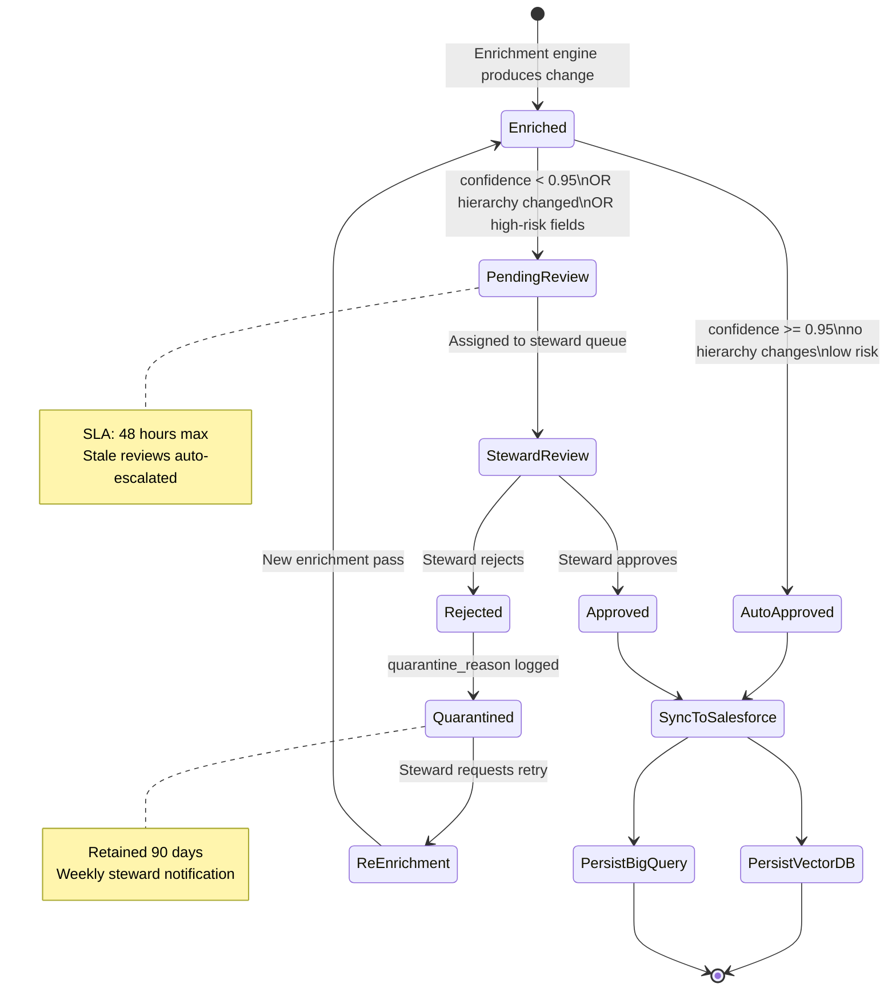

# Phase 2: Governance UI Workflow

> Extracted from [phase2_data_enrichment_flow.md](phase2_data_enrichment_flow.md)

```mermaid
stateDiagram-v2
  [*] --> Enriched: Enrichment engine produces change

  Enriched --> AutoApproved: confidence >= 0.95\nno hierarchy changes\nlow risk
  Enriched --> PendingReview: confidence < 0.95\nOR hierarchy changed\nOR high-risk fields

  PendingReview --> StewardReview: Assigned to steward queue
  StewardReview --> Approved: Steward approves
  StewardReview --> Rejected: Steward rejects

  AutoApproved --> SyncToSalesforce
  Approved --> SyncToSalesforce

  SyncToSalesforce --> PersistVectorDB
  SyncToSalesforce --> PersistBigQuery
  PersistVectorDB --> [*]
  PersistBigQuery --> [*]

  Rejected --> Quarantined: quarantine_reason logged
  Quarantined --> ReEnrichment: Steward requests retry
  ReEnrichment --> Enriched: New enrichment pass

  note right of PendingReview
    SLA: 48 hours max
    Stale reviews auto-escalated
  end note

  note right of Quarantined
    Retained 90 days
    Weekly steward notification
  end note
```
