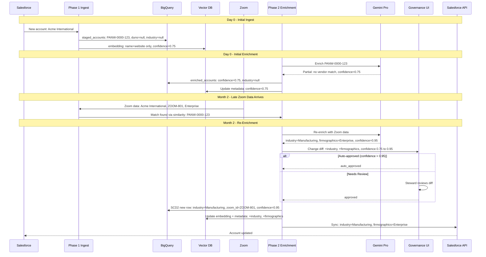

# Phase 2: Late-Arriving Enrichment Sequence

> Extracted from [phase2_data_enrichment_flow.md](phase2_data_enrichment_flow.md)

```mermaid
sequenceDiagram
  participant SF as Salesforce
  participant P1 as Phase 1 Ingest
  participant BQ as BigQuery
  participant VDB as Vector DB
  participant ZM as Zoom
  participant P2 as Phase 2 Enrichment
  participant GEM as Gemini Pro
  participant GOV as Governance UI
  participant SFAPI as Salesforce API

  Note over SF,SFAPI: Day 0 - Initial Ingest
  SF->>P1: New account: Acme International
  P1->>BQ: staged_accounts: PANW-0000-123, duns=null, industry=null
  P1->>VDB: embedding: name+website only, confidence=0.75

  Note over SF,SFAPI: Day 0 - Initial Enrichment
  P2->>GEM: Enrich PANW-0000-123
  GEM-->>P2: Partial: no vendor match, confidence=0.75
  P2->>BQ: enriched_accounts: confidence=0.75, industry=null
  P2->>VDB: Update metadata: confidence=0.75

  Note over SF,SFAPI: Month 2 - Late Zoom Data Arrives
  ZM->>P1: Zoom data: Acme International, ZOOM-801, Enterprise
  P1->>P2: Match found via similarity: PANW-0000-123

  Note over SF,SFAPI: Month 2 - Re-Enrichment
  P2->>GEM: Re-enrich with Zoom data
  GEM-->>P2: industry=Manufacturing, firmographics=Enterprise, confidence=0.95
  P2->>GOV: Change diff: +industry, +firmographics, confidence 0.75 to 0.95

  alt Auto-approved (confidence > 0.95)
    GOV-->>P2: auto_approved
  else Needs Review
    GOV->>GOV: Steward reviews diff
    GOV-->>P2: approved
  end

  P2->>BQ: SCD2 new row: industry=Manufacturing, zoom_id=ZOOM-801, confidence=0.95
  P2->>VDB: Update embedding + metadata: +industry, +firmographics
  P2->>SFAPI: Sync: industry=Manufacturing, firmographics=Enterprise
  SFAPI-->>SF: Account updated
```
