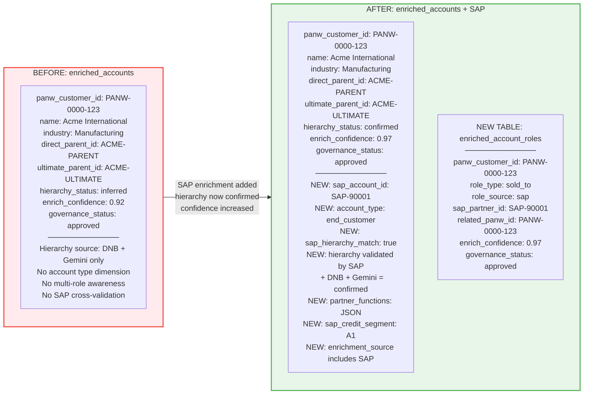

# Phase 2: SAP Impact — Before vs After

> Extracted from [phase2_data_enrichment_flow.md](phase2_data_enrichment_flow.md)

```mermaid
flowchart LR
  subgraph BEFORE["BEFORE: enriched_accounts"]
    B_TBL["panw_customer_id: PANW-0000-123\nname: Acme International\nindustry: Manufacturing\ndirect_parent_id: ACME-PARENT\nultimate_parent_id: ACME-ULTIMATE\nhierarchy_status: inferred\nenrich_confidence: 0.92\ngovernance_status: approved\n─────────────\nHierarchy source: DNB + Gemini only\nNo account type dimension\nNo multi-role awareness\nNo SAP cross-validation"]
  end

  subgraph AFTER["AFTER: enriched_accounts + SAP"]
    A_TBL["panw_customer_id: PANW-0000-123\nname: Acme International\nindustry: Manufacturing\ndirect_parent_id: ACME-PARENT\nultimate_parent_id: ACME-ULTIMATE\nhierarchy_status: confirmed\nenrich_confidence: 0.97\ngovernance_status: approved\n─────────────\nNEW: sap_account_id: SAP-90001\nNEW: account_type: end_customer\nNEW: sap_hierarchy_match: true\nNEW: hierarchy validated by SAP\n  + DNB + Gemini = confirmed\nNEW: partner_functions: JSON\nNEW: sap_credit_segment: A1\nNEW: enrichment_source includes SAP"]

    A_ROLE["NEW TABLE: enriched_account_roles\n─────────────\npanw_customer_id: PANW-0000-123\nrole_type: sold_to\nrole_source: sap\nsap_partner_id: SAP-90001\nrelated_panw_id: PANW-0000-123\nenrich_confidence: 0.97\ngovernance_status: approved"]
  end

  BEFORE -->|"SAP enrichment added\nhierarchy now confirmed\nconfidence increased"| AFTER

  style BEFORE fill:#ffebee,stroke:#f44336,stroke-width:2px
  style AFTER fill:#e8f5e9,stroke:#4CAF50,stroke-width:2px
```
