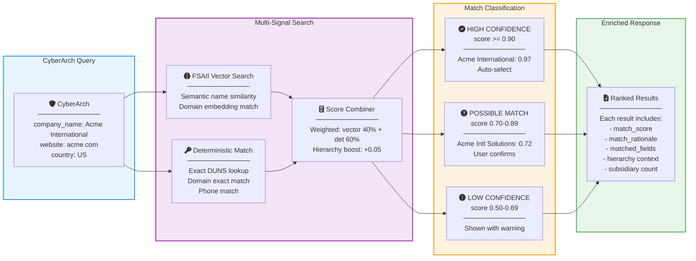

# Phase 3: CyberArch Match Flow

> Extracted from [phase3_data_master_flow.md](phase3_data_master_flow.md)

```mermaid
flowchart LR
  subgraph REQUEST["CyberArch Query"]
    CA["fa:fa-shield CyberArch\n─────────────\ncompany_name: Acme International\nwebsite: acme.com\ncountry: US"]
  end

  subgraph SEARCH["Multi-Signal Search"]
    VEC["fa:fa-brain FSAII Vector Search\n─────────────\nSemantic name similarity\nDomain embedding match"]
    DET["fa:fa-key Deterministic Match\n─────────────\nExact DUNS lookup\nDomain exact match\nPhone match"]
    COMBO["fa:fa-calculator Score Combiner\n─────────────\nWeighted: vector 40% + det 60%\nHierarchy boost: +0.05"]
  end

  subgraph CLASSIFY["Match Classification"]
    HIGH["fa:fa-check-circle HIGH CONFIDENCE\nscore >= 0.90\n─────────────\nAcme International: 0.97\nAuto-select"]
    POSS["fa:fa-question-circle POSSIBLE MATCH\nscore 0.70-0.89\n─────────────\nAcme Intl Solutions: 0.72\nUser confirms"]
    LOW["fa:fa-exclamation-circle LOW CONFIDENCE\nscore 0.50-0.69\n─────────────\nShown with warning"]
  end

  subgraph RESPONSE["Enriched Response"]
    RES["fa:fa-file-alt Ranked Results\n─────────────\nEach result includes:\n- match_score\n- match_rationale\n- matched_fields\n- hierarchy context\n- subsidiary count"]
  end

  CA --> VEC
  CA --> DET
  VEC --> COMBO
  DET --> COMBO
  COMBO --> HIGH
  COMBO --> POSS
  COMBO --> LOW
  HIGH --> RES
  POSS --> RES
  LOW --> RES

  style REQUEST fill:#e8f4fd,stroke:#2196F3,stroke-width:2px
  style SEARCH fill:#f3e5f5,stroke:#9C27B0,stroke-width:2px
  style CLASSIFY fill:#fff3e0,stroke:#FF9800,stroke-width:2px
  style RESPONSE fill:#e8f5e9,stroke:#4CAF50,stroke-width:2px
```
