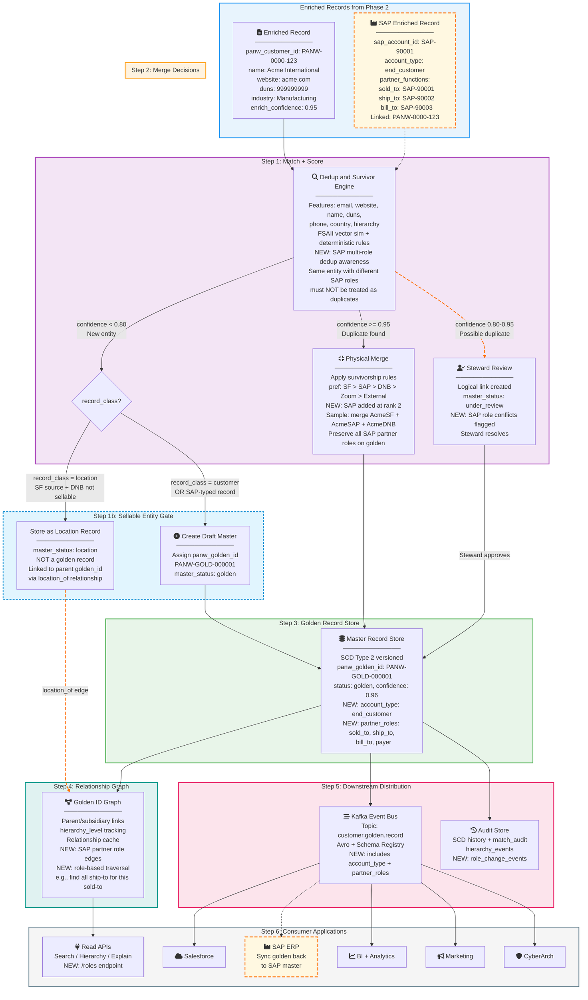

# Phase 3: Master Data Finalization (Golden Record + Survivorship)

## Goal
Deliver a single golden account view with robust survivorship, auditable hierarchy, and downstream distribution. Resolve dups in real-time with a consistent source-of-truth policy rather than fragmented rules.

## Read/Write Challenges Addressed
- Inconsistent matching and source precedence
- Lack of hierarchy audit (merges/re-parenting not tracked)
- No explainable match outputs
- No read-time relationship-aware discovery (subsidiary search)
- No monitoring of match effectiveness (false positives/negatives)

## MDM Principles Alignment
- **Data Quality**: Survivorship decisions enforce a single accurate golden record.
- **Consistency**: Source priority and rule-based merge create standard master attributes.
- **Stewardship**: Audit history in SCD and compliance dashboards support governance.
- **Master Data Management**: Panw golden ID graph and relationship APIs are core MDM capabilities.

## Storage Architecture
### Google Vector DB + MatchDB
- Keeps final candidate vectors + match history for fast golden record resolution.
- Stores `panw_golden_id`, survival decisions, and topology signatures (parent/apex link IDs).

### Gold Master Store (BigQuery / Postgres / DynamoDB)
- Persistent `golden_accounts` table with SCD Type 2 versioning.
- Stores `orchestration_status`, `survivor_policy`, `survivor_metadata`, `audit_ts`.

## Mermaid Flow Diagram — Golden Record Pipeline



## Supporting Diagrams

- [SAP Impact — Before vs After](phase3_sap_impact.md)
- [SAP Multi-Role Entity Resolution](phase3_sap_multi_role.md)
- [Sample Hierarchy Graph](phase3_hierarchy_graph.md)
- [Survivorship Decision Tree](phase3_survivorship_tree.md)
- [Event Bus Architecture](phase3_event_bus.md)
- [CyberArch Match Flow](phase3_cyberarch_flow.md)

### SAP Impact on Phase 3 Database — Before vs After

See [phase3_sap_impact.md](phase3_sap_impact.md) for the before/after diagram.

### SAP Multi-Role Entity Resolution

See [phase3_sap_multi_role.md](phase3_sap_multi_role.md) for the full entity resolution flow.

## Finalization Logic
1. Evaluate candidate signals: `email, website, name, duns, phone, hierarchy`.
   - Sample input: {"email":"sales@acme.com","website":"acme.com","name":"Acme Intl","duns":"999999999","country":"US"}
2. Compute match confidence using FSAII vector similarity + deterministic rules.
   - Sample score: 0.97 (vector sim=0.94, name fuzzy=0.98, website exact=1.0)
3. If confidence > 0.95 -> direct merge as "survivor"; else flag for human review.
   - Sample decision: survivor=true, review_needed=false
4. Apply survivorship policy:
   - preferred source: `Salesforce > DNB > Zoom > External` (example)
   - rule for each attribute set: latest non-null, highest confidence, trust score.
   - maintain `survivor_source` and `survivor_reason` for each field.
   - Sample outcome: name from Salesforce, website from DNB, phone from Zoom.
5. Create/merge `panw_golden_id` and persist equivalence set.
   - Sample record: {"panw_golden_id":"PANW-GOLD-000001","source_ids":["SF-555","DNB-888"]}
6. Track hierarchy events:
   - `parent_change`, `apex_change`, `acquisition`, `split`.
   - Sample event: {"event":"parent_change","old_parent":"PANW-GOLD-000010","new_parent":"PANW-GOLD-000015","ts":"2026-03-23T10:06:00Z"}
7. Emit explainable match results: `match_rationale`, `matched_fields`, `score`
   - Sample explanation: {"matched_fields":["name","website","duns"],"match_rationale":"high overlap + stable identifiers","score":0.97}

## Sample Master Record
- panw_golden_id: "PANW-GOLD-000001"
- panw_customer_id: "PANW-0000-123"
- precedent_source_id: "SF-555"
- duns_number: "999999999"
- name: "Acme Intl"
- website: "acme.com"
- ultimate_parent_id: "PANW-GOLD-000015"
- direct_parent_id: "PANW-GOLD-000010"
- hierarchy_level: 2
- status: "active"
- master_status: "golden"
- confidence_score: 0.96
- company_type: "Corp"
- industry: "Manufacturing"
- created_at: "2026-03-23T10:05:20Z"
- updated_at: "2026-03-23T10:06:50Z"
- source_owners: ["salesforce", "dnb", "zoom"]
- survivor_metadata: {
    "name": {"source": "salesforce", "rule": "latest_high_confidence"},
    "website": {"source": "dnb", "rule": "highest_trust"}
  }

## Sample Hierarchy Graph

See [phase3_hierarchy_graph.md](phase3_hierarchy_graph.md) for the full hierarchy tree visualization.

## Downstream and Monitoring
- Publish `customer.golden.record` to Kafka/event bus
- Maintain match ROI metrics: duplicate rate, false positive rate, false negative rate
- Search API supports parent/child traversal and `explain` for each match
- Governance dashboard shows master health, lineage, and historical parent changes

---

## Field-Level Survivorship Rules

Survivorship determines which source's value wins for each attribute in the golden record. Rules are evaluated per field, not per record.

### Source Trust Hierarchy

| Rank | Source | Rationale |
|------|--------|-----------|
| 1 | Salesforce | Primary CRM; most recent human-verified input |
| 2 | DNB | Authoritative vendor for firmographic and hierarchy data |
| 3 | Zoom | Strong firmographic signals but narrower coverage |
| 4 | External / Other | Lowest trust; used only when no other source provides the field |

### Per-Field Rules

| Field | Rule | Tiebreaker | Example |
|-------|------|------------|---------|
| `name` | **Highest trust source** with non-null value | Most recently updated | Salesforce "Acme International" wins over DNB "ACME INTERNATIONAL CORP" |
| `website` | **Highest trust source** with non-null, validated domain | Domain validation score (is it reachable?) | DNB "acme.com" wins if Salesforce has null; Salesforce wins if both present |
| `duns_number` | **DNB always wins** (authoritative source) | — | DNB "999999999" always selected |
| `phone` | **Most recently updated** non-null value | Source trust rank | Zoom "+14151234567" (updated 2026-05) wins over Salesforce "+14151230000" (updated 2025-01) |
| `email` | **Most recently updated** non-null value | Source trust rank | Latest non-null email from any source |
| `address_line1`, `city`, `state`, `country` | **Highest completeness score** (fewest nulls in address block) | Source trust rank | If DNB provides full address and Salesforce only has city+state, DNB wins for entire address block |
| `company_type` | **DNB preferred** (authoritative for business classification) | Gemini Pro inference if DNB unavailable | DNB "Corp" wins |
| `industry` | **Highest confidence** enrichment value | Source trust rank | Gemini Pro "Manufacturing" (confidence 0.95) wins over Zoom "Tech" (confidence 0.70) |
| `segment` | **Zoom preferred** (best firmographic signals) | Gemini Pro inference | Zoom "Enterprise" wins |
| `employee_range` | **DNB preferred** | Zoom fallback | DNB "1000-5000" wins |
| `direct_parent_id` | **Hierarchy inference** (Gemini Pro + DNB graph) | DNB hierarchy if both available | AI-inferred parent validated against DNB hierarchy |
| `ultimate_parent_id` | **DNB hierarchy** (authoritative for apex) | Gemini Pro inference | DNB apex always wins when available |

### Recency vs. Trust Conflict Resolution
When a high-trust source has a stale value and a lower-trust source has a fresh value:
1. If the field has a **recency rule** (phone, email): the fresher value wins regardless of source trust, as long as the source is rank 1–3.
2. If the field has a **trust rule** (name, DUNS, company_type): the higher-trust source wins regardless of recency.
3. If the field has a **confidence rule** (industry, segment): the highest-confidence value wins, with trust rank as tiebreaker.
4. The decision is logged in `survivor_metadata` with `{source, rule, confidence, recency_ts}` for auditability.

### Survivorship Decision Tree

See [phase3_survivorship_tree.md](phase3_survivorship_tree.md) for the full decision tree diagram.

### Merge vs. Link Decision
- **Physical merge**: When match confidence > 0.95 and all survivorship rules resolve cleanly, records are physically merged into a single golden record. Contributing records in `enriched_accounts` retain their individual rows but are linked via `golden_equivalence_set`.
- **Logical link**: When match confidence is 0.80–0.95 or survivorship produces conflicting values that require steward review, records are logically linked (both appear in the equivalence set) but the golden record is marked `master_status: under_review`. Steward resolves conflicts in the Governance UI.
- **No merge**: When match confidence < 0.80, records remain separate golden entities.

---

## Error Handling & Failure Modes

### Dedup Engine Failures

| Failure Mode | Detection | Response | Recovery |
|-------------|-----------|----------|----------|
| Vector DB unreachable during dedup scoring | Connection timeout / gRPC error | Record marked `orchestration_status: dedup_deferred`. Written to golden store as `master_status: draft` (not yet deduplicated). | Background job re-runs dedup for `dedup_deferred` records when Vector DB recovers. |
| Dedup engine produces conflicting merge groups (A merges with B, B merges with C, but A and C don't match) | Transitive closure check detects inconsistency | Flag entire candidate group for steward review. Mark all records `master_status: under_review`. | Steward resolves group membership manually. System records decision in `match_audit`. |
| Survivorship rule produces null for a required field (all sources have null) | Post-merge validation | Golden record created with `master_status: draft` and `orchestration_status: pending_enrichment`. Trigger re-enrichment request to Phase 2. | Phase 2 re-enrichment fills the gap; golden record re-processed when enrichment completes. |

### Golden Record Write Failures

| Failure Mode | Detection | Response | Recovery |
|-------------|-----------|----------|----------|
| Gold Master Store write failure | API error / timeout | Buffer to retry queue. Emit `golden_write_failure` alert. | Retry with exponential backoff (3 attempts). On persistent failure, escalate to on-call. |
| SCD2 versioning conflict (concurrent updates to same golden record) | Optimistic locking / version check | Reject later write; re-read current state; re-apply merge logic. | Automatic retry with fresh read. If conflict persists after 3 retries, route to steward. |

### Kafka / Event Bus Failures

| Failure Mode | Detection | Response | Recovery |
|-------------|-----------|----------|----------|
| Kafka broker unavailable | Producer error / timeout | Buffer events to local queue. Golden record is persisted but event is not published. | Replay buffered events when Kafka recovers. Consumer idempotency ensures no duplicate processing. |
| Consumer fails to process golden record event | Consumer lag monitoring / DLQ | Event routed to Kafka DLQ after 3 consumer retries. | Operations team reviews DLQ. Fix consumer bug and replay. |
| Event schema mismatch (producer schema evolves, consumer not updated) | Schema registry validation | Reject publish if schema is not backward-compatible. | Use Avro/Protobuf with schema registry. All schema changes require backward compatibility. |

### Hierarchy Graph Failures

| Failure Mode | Detection | Response | Recovery |
|-------------|-----------|----------|----------|
| Circular hierarchy detected post-merge | Graph cycle detection job (runs after every merge) | Break cycle by removing the lowest-confidence edge. Mark affected records for steward review. Log to `hierarchy_events`. | Steward confirms correct hierarchy. System re-processes affected subgraph. |
| Orphaned golden record (no parent, should have one) | Orphan detection job (weekly) | Emit `orphaned_record` alert. Mark `hierarchy_status: orphaned`. | Steward assigns parent manually or triggers re-inference from Phase 2. |

---

## Integration Architecture

### Downstream Consumer Interfaces

| Consumer | Protocol | Data Delivered | Frequency |
|----------|----------|---------------|-----------|
| Salesforce | REST API / Bulk API 2.0 | Golden record updates (name, hierarchy, DUNS, enriched fields) | Near-real-time (event-driven via Kafka) |
| BI / Analytics | BigQuery direct query | `golden_accounts`, `hierarchy_events`, `match_audit` tables | On-demand (SQL) |
| Marketing Platforms | Kafka consumer / REST API | Golden record + segment + industry for audience building | Near-real-time |
| CyberArch | Dedicated Match API (see below) | Ranked match candidates with hierarchy context | On-demand (per query) |
| Compliance / Audit | BigQuery direct query | SCD2 history, `match_audit`, `hierarchy_events` | On-demand |

### Event Bus Architecture

See [phase3_event_bus.md](phase3_event_bus.md) for the full Kafka consumer architecture diagram.

- **Topic**: `customer.golden.record`
- **Schema**: Avro with schema registry (backward-compatible evolution)
- **Partitioning**: By `panw_golden_id` hash (ensures ordering per entity)
- **Retention**: 7 days on topic; permanent in BigQuery audit tables
- **Consumer groups**: One per downstream system; independent offset tracking
- **Idempotency**: All consumers must handle duplicate events (use `panw_golden_id` + `updated_at` as dedup key)

### Read API Specification

| Endpoint | Method | Description |
|----------|--------|-------------|
| `/api/v1/golden/{panw_golden_id}` | GET | Retrieve golden record by ID |
| `/api/v1/golden/search` | POST | Search golden records by name, domain, address, DUNS (vector + deterministic) |
| `/api/v1/golden/{panw_golden_id}/hierarchy` | GET | Get parent/subsidiary tree for a golden entity |
| `/api/v1/golden/{panw_golden_id}/explain` | GET | Get match rationale, contributing fields, confidence breakdown |
| `/api/v1/golden/{panw_golden_id}/history` | GET | Get SCD2 version history |
| `/api/v1/golden/{panw_golden_id}/equivalence` | GET | Get all contributing source records |

---

## CyberArch Integration Specification

### Problem Statement
CyberArch matching struggles with similar/overlapping account names because it lacks a match classification and ranking framework. The current search relies on exact or fuzzy name matching without hierarchy, domain, or identifier signals.

### Solution: Dedicated CyberArch Match API

#### CyberArch Match Flow

See [phase3_cyberarch_flow.md](phase3_cyberarch_flow.md) for the full match flow diagram.

**Endpoint**: `POST /api/v1/cyberarch/match`

**Request**:
```json
{
  "company_name": "Acme International",
  "website": "acme.com",
  "country": "US",
  "duns_number": null,
  "max_results": 10,
  "include_hierarchy": true,
  "include_explanation": true
}
```

**Response**:
```json
{
  "query_id": "QRY-20260323-001",
  "results": [
    {
      "panw_golden_id": "PANW-GOLD-000001",
      "name": "Acme International",
      "website": "acme.com",
      "duns_number": "999999999",
      "match_score": 0.97,
      "match_classification": "HIGH_CONFIDENCE",
      "matched_fields": ["name", "website", "country"],
      "match_rationale": "Exact domain match + semantic name similarity 0.98 + same country",
      "hierarchy": {
        "direct_parent": {"panw_golden_id": "PANW-GOLD-000010", "name": "Acme Parent Corp"},
        "ultimate_parent": {"panw_golden_id": "PANW-GOLD-000015", "name": "Acme Holdings"},
        "subsidiaries_count": 12
      }
    },
    {
      "panw_golden_id": "PANW-GOLD-000042",
      "name": "Acme Intl Solutions",
      "website": "acme-solutions.com",
      "duns_number": "888888888",
      "match_score": 0.72,
      "match_classification": "POSSIBLE_MATCH",
      "matched_fields": ["name"],
      "match_rationale": "Partial name overlap (Acme) but different domain and DUNS",
      "hierarchy": {
        "direct_parent": null,
        "ultimate_parent": null,
        "subsidiaries_count": 0
      }
    }
  ],
  "metadata": {
    "total_candidates_evaluated": 47,
    "processing_time_ms": 145,
    "model_version": "fsaii-v2.1"
  }
}
```

### Match Classification Framework

| Classification | Score Range | Action |
|---------------|------------|--------|
| `HIGH_CONFIDENCE` | >= 0.90 | Auto-select as match; no manual verification needed |
| `POSSIBLE_MATCH` | 0.70–0.89 | Present to user with explanation; user confirms or rejects |
| `LOW_CONFIDENCE` | 0.50–0.69 | Show as "other results" with clear warning |
| `NO_MATCH` | < 0.50 | Not returned in results |

### Key Improvements Over Current CyberArch Matching
1. **Multi-signal scoring**: Combines name, domain, address, DUNS, phone, and hierarchy signals (not just name).
2. **Explainable results**: Every result includes `match_rationale` and `matched_fields` so the CyberArch user understands why a candidate was ranked.
3. **Hierarchy-aware**: Results include parent/subsidiary context, enabling discovery of related entities even when the direct name is unknown.
4. **Classification tiers**: Clear confidence buckets (HIGH / POSSIBLE / LOW) replace the current ambiguous ranking.
5. **Subsidiary discovery**: Can search by parent and discover all subsidiaries, addressing RC-03 and RC-07.

---

## Match Effectiveness Monitoring

### KPIs Tracked

| Metric | Definition | Target | Dashboard |
|--------|-----------|--------|-----------|
| Duplicate detection rate | % of true duplicates caught by dedup engine | >= 95% | Master Health |
| False positive rate | % of merge decisions that were incorrect (unmerged by steward) | < 5% | Master Health |
| False negative rate | % of true duplicates missed by dedup engine (found later) | < 8% | Master Health |
| User re-selection rate | % of CyberArch match results where user selected a lower-ranked candidate | < 10% | Search Quality |
| Golden record completeness | % of golden records with all critical fields populated | >= 90% | Master Health |
| Hierarchy coverage | % of golden records with at least direct_parent assigned | >= 85% | Hierarchy Health |
| Merge reversal rate | % of merges reversed by steward within 30 days | < 3% | Governance |
| Avg. golden resolution time | Time from enriched record to golden record assignment | < 5 minutes (p95) | Pipeline Health |

### Feedback Loop
1. CyberArch logs every user search, selected result, and any re-selections.
2. Weekly batch job analyzes re-selection patterns to identify systematic match weaknesses.
3. Findings feed back into FSAII model retraining and survivorship rule tuning.
4. Monthly match quality review with data governance committee.

