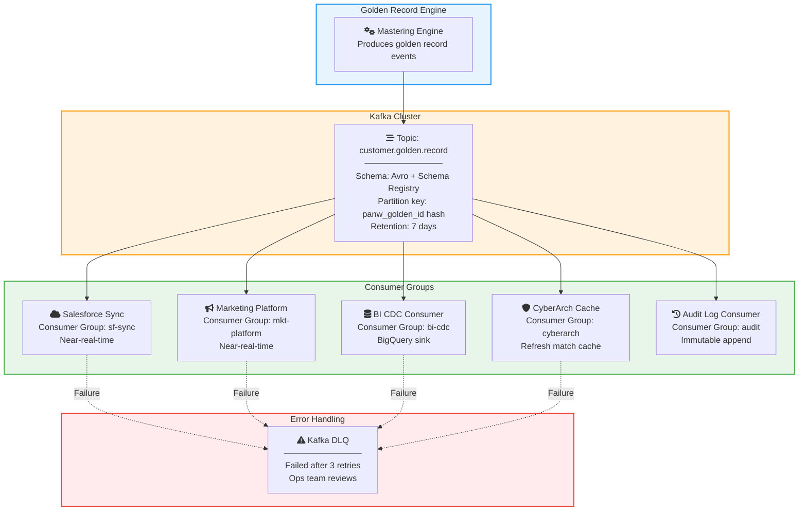

# Phase 3: Event Bus Architecture

> Extracted from [phase3_data_master_flow.md](phase3_data_master_flow.md)

```mermaid
flowchart TB
  subgraph PRODUCE["Golden Record Engine"]
    GRE["fa:fa-cogs Mastering Engine\nProduces golden record events"]
  end

  subgraph KAFKA["Kafka Cluster"]
    TOPIC["fa:fa-stream Topic: customer.golden.record\n─────────────\nSchema: Avro + Schema Registry\nPartition key: panw_golden_id hash\nRetention: 7 days"]
  end

  subgraph CONSUMERS["Consumer Groups"]
    direction LR
    CG1["fa:fa-cloud Salesforce Sync\nConsumer Group: sf-sync\nNear-real-time"]
    CG2["fa:fa-bullhorn Marketing Platform\nConsumer Group: mkt-platform\nNear-real-time"]
    CG3["fa:fa-database BI CDC Consumer\nConsumer Group: bi-cdc\nBigQuery sink"]
    CG4["fa:fa-shield CyberArch Cache\nConsumer Group: cyberarch\nRefresh match cache"]
    CG5["fa:fa-history Audit Log Consumer\nConsumer Group: audit\nImmutable append"]
  end

  subgraph DLQ_LAYER["Error Handling"]
    DLQ["fa:fa-exclamation-triangle Kafka DLQ\n─────────────\nFailed after 3 retries\nOps team reviews"]
  end

  GRE --> TOPIC
  TOPIC --> CG1
  TOPIC --> CG2
  TOPIC --> CG3
  TOPIC --> CG4
  TOPIC --> CG5
  CG1 -.->|"Failure"| DLQ
  CG2 -.->|"Failure"| DLQ
  CG3 -.->|"Failure"| DLQ
  CG4 -.->|"Failure"| DLQ

  style PRODUCE fill:#e8f4fd,stroke:#2196F3,stroke-width:2px
  style KAFKA fill:#fff3e0,stroke:#FF9800,stroke-width:2px
  style CONSUMERS fill:#e8f5e9,stroke:#4CAF50,stroke-width:2px
  style DLQ_LAYER fill:#ffebee,stroke:#f44336,stroke-width:2px
```
