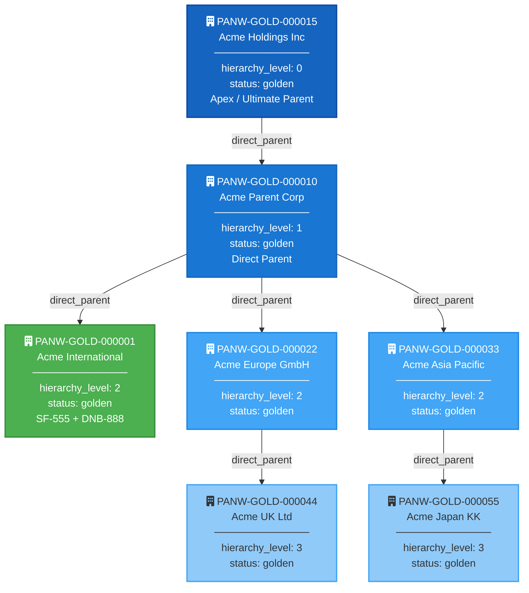

# Phase 3: Sample Hierarchy Graph

> Extracted from [phase3_data_master_flow.md](phase3_data_master_flow.md)

```mermaid
graph TB
  APEX["fa:fa-building PANW-GOLD-000015\nAcme Holdings Inc\n─────────────\nhierarchy_level: 0\nstatus: golden\nApex / Ultimate Parent"]

  PARENT["fa:fa-building PANW-GOLD-000010\nAcme Parent Corp\n─────────────\nhierarchy_level: 1\nstatus: golden\nDirect Parent"]

  CHILD1["fa:fa-building PANW-GOLD-000001\nAcme International\n─────────────\nhierarchy_level: 2\nstatus: golden\nSF-555 + DNB-888"]

  CHILD2["fa:fa-building PANW-GOLD-000022\nAcme Europe GmbH\n─────────────\nhierarchy_level: 2\nstatus: golden"]

  CHILD3["fa:fa-building PANW-GOLD-000033\nAcme Asia Pacific\n─────────────\nhierarchy_level: 2\nstatus: golden"]

  GRAND1["fa:fa-building PANW-GOLD-000044\nAcme UK Ltd\n─────────────\nhierarchy_level: 3\nstatus: golden"]

  GRAND2["fa:fa-building PANW-GOLD-000055\nAcme Japan KK\n─────────────\nhierarchy_level: 3\nstatus: golden"]

  APEX -->|"direct_parent"| PARENT
  PARENT -->|"direct_parent"| CHILD1
  PARENT -->|"direct_parent"| CHILD2
  PARENT -->|"direct_parent"| CHILD3
  CHILD2 -->|"direct_parent"| GRAND1
  CHILD3 -->|"direct_parent"| GRAND2

  style APEX fill:#1565C0,stroke:#0D47A1,color:#fff,stroke-width:2px
  style PARENT fill:#1976D2,stroke:#1565C0,color:#fff,stroke-width:2px
  style CHILD1 fill:#4CAF50,stroke:#388E3C,color:#fff,stroke-width:2px
  style CHILD2 fill:#42A5F5,stroke:#1E88E5,color:#fff,stroke-width:2px
  style CHILD3 fill:#42A5F5,stroke:#1E88E5,color:#fff,stroke-width:2px
  style GRAND1 fill:#90CAF9,stroke:#42A5F5,stroke-width:2px
  style GRAND2 fill:#90CAF9,stroke:#42A5F5,stroke-width:2px
```
