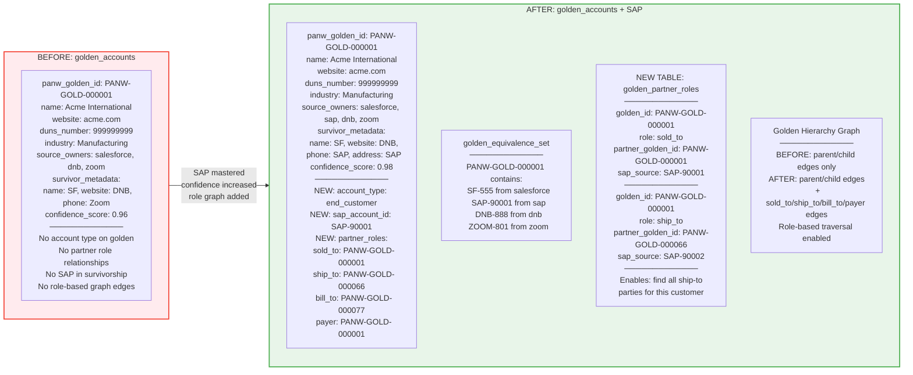

# Phase 3: SAP Impact — Before vs After

> Extracted from [phase3_data_master_flow.md](phase3_data_master_flow.md)

```mermaid
flowchart LR
  subgraph BEFORE["BEFORE: golden_accounts"]
    B_GOLD["panw_golden_id: PANW-GOLD-000001\nname: Acme International\nwebsite: acme.com\nduns_number: 999999999\nindustry: Manufacturing\nsource_owners: salesforce, dnb, zoom\nsurvivor_metadata:\n  name: SF, website: DNB, phone: Zoom\nconfidence_score: 0.96\n─────────────\nNo account type on golden\nNo partner role relationships\nNo SAP in survivorship\nNo role-based graph edges"]
  end

  subgraph AFTER["AFTER: golden_accounts + SAP"]
    A_GOLD["panw_golden_id: PANW-GOLD-000001\nname: Acme International\nwebsite: acme.com\nduns_number: 999999999\nindustry: Manufacturing\nsource_owners: salesforce, sap, dnb, zoom\nsurvivor_metadata:\n  name: SF, website: DNB,\n  phone: SAP, address: SAP\nconfidence_score: 0.98\n─────────────\nNEW: account_type: end_customer\nNEW: sap_account_id: SAP-90001\nNEW: partner_roles:\n  sold_to: PANW-GOLD-000001\n  ship_to: PANW-GOLD-000066\n  bill_to: PANW-GOLD-000077\n  payer: PANW-GOLD-000001"]

    A_EQUIV["golden_equivalence_set\n─────────────\nPANW-GOLD-000001 contains:\n  SF-555 from salesforce\n  SAP-90001 from sap\n  DNB-888 from dnb\n  ZOOM-801 from zoom"]

    A_ROLES["NEW TABLE: golden_partner_roles\n─────────────\ngolden_id: PANW-GOLD-000001\nrole: sold_to\npartner_golden_id: PANW-GOLD-000001\nsap_source: SAP-90001\n─────────────\ngolden_id: PANW-GOLD-000001\nrole: ship_to\npartner_golden_id: PANW-GOLD-000066\nsap_source: SAP-90002\n─────────────\nEnables: find all ship-to\nparties for this customer"]

    A_GRAPH["Golden Hierarchy Graph\n─────────────\nBEFORE: parent/child edges only\nAFTER: parent/child edges\n  + sold_to/ship_to/bill_to/payer edges\nRole-based traversal enabled"]
  end

  BEFORE -->|"SAP mastered\nconfidence increased\nrole graph added"| AFTER

  style BEFORE fill:#ffebee,stroke:#f44336,stroke-width:2px
  style AFTER fill:#e8f5e9,stroke:#4CAF50,stroke-width:2px
```
