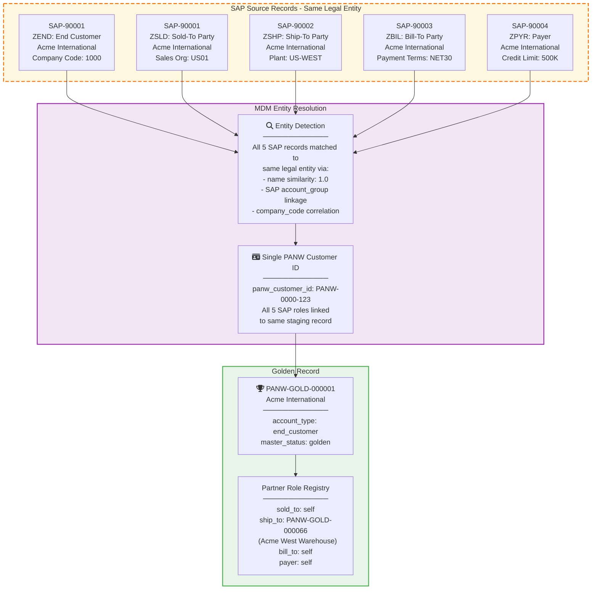

# Phase 3: SAP Multi-Role Entity Resolution

> Extracted from [phase3_data_master_flow.md](phase3_data_master_flow.md)

The key challenge with SAP is that a single legal entity (e.g., Acme International) can appear as multiple SAP partner records with different roles. The MDM must recognize these are the **same entity** with **different roles**, not duplicates.

