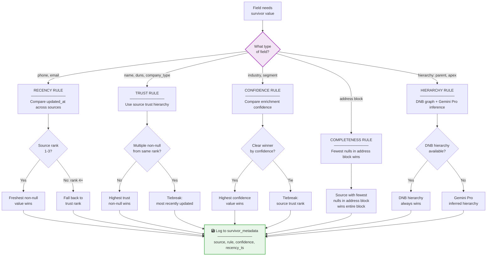

# Phase 3: Survivorship Decision Tree

> Extracted from [phase3_data_master_flow.md](phase3_data_master_flow.md)

```mermaid
flowchart TB
  START["Field needs\nsurvivor value"] --> TYPE{"What type\nof field?"}

  TYPE -->|"phone, email"| RECENCY["RECENCY RULE\n─────────────\nCompare updated_at across sources"]
  TYPE -->|"name, duns, company_type"| TRUST["TRUST RULE\n─────────────\nUse source trust hierarchy"]
  TYPE -->|"industry, segment"| CONFIDENCE["CONFIDENCE RULE\n─────────────\nCompare enrichment confidence"]
  TYPE -->|"address block"| COMPLETENESS["COMPLETENESS RULE\n─────────────\nFewest nulls in address block wins"]
  TYPE -->|"hierarchy: parent, apex"| HIERARCHY["HIERARCHY RULE\n─────────────\nDNB graph + Gemini Pro inference"]

  RECENCY --> R_CHK{"Source rank\n1-3?"}
  R_CHK -->|"Yes"| R_WIN["Freshest non-null\nvalue wins"]
  R_CHK -->|"No: rank 4+"| R_TRUST["Fall back to\ntrust rank"]

  TRUST --> T_CHK{"Multiple non-null\nfrom same rank?"}
  T_CHK -->|"No"| T_WIN["Highest trust\nnon-null wins"]
  T_CHK -->|"Yes"| T_RECENT["Tiebreak:\nmost recently updated"]

  CONFIDENCE --> C_CHK{"Clear winner\nby confidence?"}
  C_CHK -->|"Yes"| C_WIN["Highest confidence\nvalue wins"]
  C_CHK -->|"Tie"| C_TRUST["Tiebreak:\nsource trust rank"]

  COMPLETENESS --> COMP_WIN["Source with fewest\nnulls in address block\nwins entire block"]
  HIERARCHY --> H_DNB{"DNB hierarchy\navailable?"}
  H_DNB -->|"Yes"| H_WIN["DNB hierarchy\nalways wins"]
  H_DNB -->|"No"| H_AI["Gemini Pro\ninferred hierarchy"]

  R_WIN --> LOG
  R_TRUST --> LOG
  T_WIN --> LOG
  T_RECENT --> LOG
  C_WIN --> LOG
  C_TRUST --> LOG
  COMP_WIN --> LOG
  H_WIN --> LOG
  H_AI --> LOG

  LOG["fa:fa-save Log to survivor_metadata\n─────────────\nsource, rule, confidence, recency_ts"]

  style TYPE fill:#f3e5f5,stroke:#9C27B0,stroke-width:2px
  style LOG fill:#e8f5e9,stroke:#4CAF50,stroke-width:2px
```
